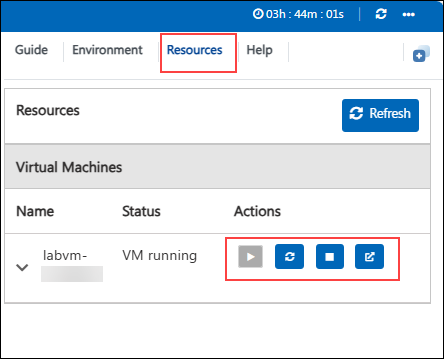

# Fabric Copilot

### Overall Estimated Duration: 4 Hours

## Overview

This hands-on lab introduces participants to Microsoft Fabric and its Copilot features. It covers setting up a Fabric workspace, ingesting data via pipelines, using Copilot in notebooks for data transformation, and leveraging Copilot in Power BI to generate visualizations and DAX queries streamlining analytics through AI-powered assistance.

## Objectives

This lab is designed to provide participants with practical experience in utilizing Microsoft Fabric and its Copilot feature to create workspaces, ingest and transform data, and analyze data within a warehouse.

- **Getting Started with Microsoft Fabric: Activate Trial and Set Up a Workspace:** It introduces users to Microsoft Fabric by guiding them through the process of activating a free trial and creating their first workspace.
- **Explore Copilot for Data Flows:** It provides an introduction to using Microsoft Fabric Copilot to simplify data transformation and pipeline creation. With natural language input, users can generate, edit, and manage data flows more efficiently streamlining tasks like data ingestion, mapping, and transformation without writing complex code.
- **Visualizing and gaining Insights using Copilot for Power BI:** it explores how to leverage Copilot in Power BI to create reports, generate visuals, and uncover insights using natural language. It simplifies data analysis by allowing users to ask questions and build dashboards without deep technical skills, making data exploration more intuitive and accessible.

## Prerequisites

Participants should have the following prerequisites:

- **Basic understanding of data management and analytics:** Familiarity with data concepts and terminology will aid in navigating Microsoft Fabric's features.
- **Familiarity with Microsoft 365 tools:** Experience with common Microsoft 365 applications, such as Excel and Power BI, will be beneficial.
- **Knowledge of SQL and data visualization:** Understanding SQL queries and data visualization techniques will assist in executing the lab tasks effectively.

## Architecture

The architecture for the **Microsoft Fabric with Copilot** lab enables end-to-end data integration, analytics, and visualization workflows using Fabric's advanced tools and AI capabilities. It begins with creating a dedicated **workspace** to manage resources and collaborate effectively. **Data ingestion** is facilitated through **pipelines** and **Spark-powered** notebooks, storing data in a **Lakehouse** for analysis. Structured data is processed in a **data warehouse**, where **tables** and **data models** are created for efficient querying and reporting. **Fabric Copilot** enhances automation by enabling natural language interactions for data ingestion, transformation, and report generation. This streamlined architecture provides scalability, productivity, and actionable insights, supporting complex data engineering and analytics scenarios.

## Explanation of Components

The architecture for this lab involves several key components:

- **Microsoft Fabric:** A comprehensive data analytics platform that integrates tools for data engineering, analytics, and visualization, including AI-powered capabilities like Fabric Copilot.

- **Workspace:** A collaborative environment within Microsoft Fabric where resources, projects, and tools are managed, enabling efficient organization and teamwork.

- **Lakehouse:** A unified data storage architecture combining the benefits of data lakes and data warehouses, optimized for both raw and structured data.  

- **Pipeline:** A sequence of data processing steps used to implement ETL (Extract, Transform, Load) or ELT (Extract, Load, Transform) workflows to move and process data.  

- **Notebook:** An interactive tool in Fabric that allows users to write and execute Apache Spark code for data analysis and transformation at scale.  

- **SQL:** A programming language used to query, manipulate, and analyze data stored in tables within the Lakehouse or other data stores.  

- **Visual Query:** A graphical interface that enables users to design and execute data queries without writing code, making data exploration more accessible.

- **Report:** A structured presentation of data insights, often with visualizations like charts and graphs, created for stakeholders to analyze results.

- **Fabric Copilot:** An AI-driven assistant in Microsoft Fabric that helps automate tasks such as data ingestion, transformation, and reporting using natural language commands.

- **Dataflow Gen2:** A modernized data pipeline tool in Fabric that enables the creation of scalable and automated workflows for ingesting and transforming data.

- **Data Warehouse:** A centralized, structured repository optimized for querying and reporting, used for storing processed data ready for analysis.

- **Table:** A structured arrangement of data in rows and columns, used to organize and store information in databases or warehouses.  

- **Data Model:** A structured representation of data and its relationships, designed to enhance analytical queries and reporting efficiency.

**Fabric trial provides access to most features, but excludes Copilot, private links, and trusted workspace access ([learn more](https://learn.microsoft.com/en-us/fabric/fundamentals/fabric-trial#overview-of-the-trial-capacity)).**
  

## Getting Started with the Lab
 
Welcome to your Fabric Copilot Workshop! We've prepared a seamless environment for you to explore and learn about Azure services. Let's begin by making the most of this experience:
 
## Accessing Your Lab Environment
 
Once you're ready to dive in, your virtual machine and lab guide will be right at your fingertips within your web browser.

## Virtual Machine & Lab Guide
 
Your virtual machine is your workhorse throughout the workshop. The **Guide** is your roadmap to success.


## Exploring Your Lab Resources
 
To get a better understanding of your lab resources and credentials, navigate to the **Environment** tab.
 

 
## Utilizing the Split Window Feature
 
For convenience, you can open the lab guide in a separate window by selecting the **Split Window** button from the Top right corner.
 

 
## Managing Your Virtual Machine
 
Feel free to start, stop, or restart your virtual machine as needed from the **Resources** tab. Your experience is in your hands!



## Lab Guide Zoom In/Zoom Out

To adjust the zoom level for the environment page, click the **A↕ : 100%** icon located next to the timer in the lab environment.

.png)

## Let's Get Started with Fabric Portal
 
1. On the Lab VM, open **Microsoft Edge** from the desktop. In a new tab, navigate to **Microsoft Fabric** by copying and pasting the following URL into the address bar:

   ```
   https://app.fabric.microsoft.com/home
   ```

2. On the **Enter your email, we'll check if you need to create a new account** tab, you will see the login screen, in that enter the following email/username, and click on **Submit**.
 
   - **Email/Username:** <inject key="AzureAdUserEmail"></inject>
 
     .png)
 
3. Now enter the following password and click on **Sign in**.
 
   - **Password:** <inject key="AzureAdUserPassword"></inject>
 
     
     
1. If you see the pop-up **Stay Signed in?**, select **Yes**.

   

1. On Welcome to the Fabric view dialog opens, click **Cancel**.

    

1. On Microsoft Fabric (Free) license assignment dialog appears, click **OK** to proceed.

   

1. You will be navigated to the **Microsoft** **Fabric Home page**.

   

   >**Note:** If you receive any pop-ups, please **Close** them.

   

## Support Contact

The CloudLabs support team is available 24/7, 365 days a year, via email and live chat to ensure seamless assistance at any time. We offer dedicated support channels tailored specifically for both learners and instructors, ensuring that all your needs are promptly and efficiently addressed.

Learner Support Contacts:

- Email Support: cloudlabs-support@spektrasystems.com
- Live Chat Support: https://cloudlabs.ai/labs-support

Now, click on **Next** from the lower right corner to move on to the next page.


### Happy Learning!
