# Exercise 1: Getting Started with Microsoft Fabric – Set Up a Workspace

### Estimated Duration: 30 Minutes

## 📘 Lab Scenario

Contoso Retail is implementing **Microsoft Fabric** to centralize its analytics and reporting workloads. As the first step, you will prepare the environment by activating the Microsoft Fabric Free Trial (if required) and creating a workspace linked to a **Copilot-enabled Fabric capacity**, providing the foundation for subsequent data ingestion, modeling, and AI-assisted reporting tasks.

## 📋  Overview

In this exercise, you will create a new workspace using the pre-deployed Fabric capacity. The workspace will be linked to a Copilot-enabled capacity, allowing you to prepare the environment for bringing in data, building models, and generating reports using Microsoft Fabric’s integrated tools.

## 🎯 Objectives

In this exercise, you will complete the following tasks:

- Task 1: Start the Microsoft Fabric Free Trial
- Task 2: Create a workspace and link with Fabric Copilot-enabled capacity

### Task 1: Start the Microsoft Fabric Free Trial

In this task, you will activate the free 60-day Microsoft Fabric trial. This trial provides access to Fabric’s powerful data analytics, integration, and visualization features, enabling you to explore and work with the platform without requiring an active license.

1. In the top right corner of the screen, select the **User icon (1)**. Select **Start trial (2)** and click on **Fabric and PowerBI (3)**.

   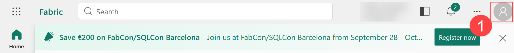

   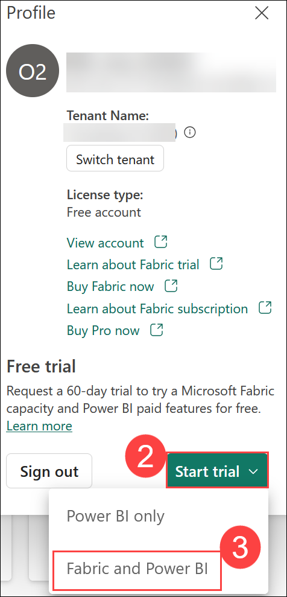

1. When **Activate your 60-day free Fabric trial capacity** dialog opens. Select **Activate**.

   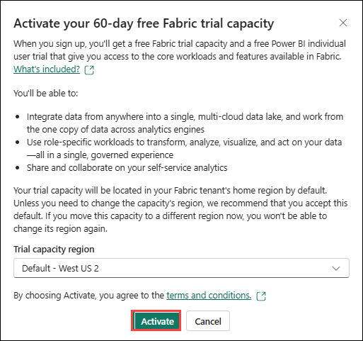

    > **Note:** The trial capacity region may differ from the one shown in the screenshot. No need to worry – simply use the default selected region, activate it, and continue to the next step.

    >**Note:** If you see the message **Unable to start the Fabric Trial as the maximum number of trials for this tenant has been reached**, you can safely ignore it and continue with the lab. To confirm that Fabric Trial is already active for your account, check the top toolbar in the Fabric portal.

    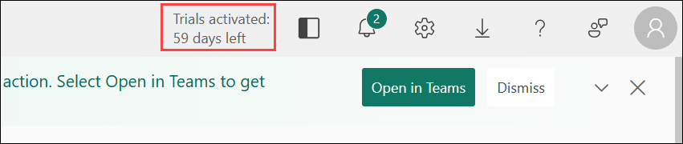

1. On **Your Fabric and Power BI trials are active** dialog. Select **OK**.

   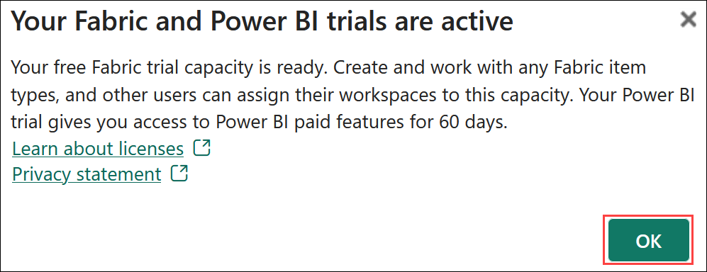

1. If the **Invite teammates to try Fabric to extend your trial** window appears, please close it.  

    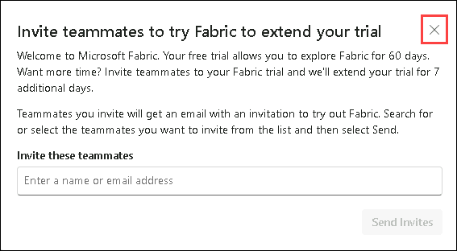

1. You will be navigated to the **Microsoft Fabric Home page**.

   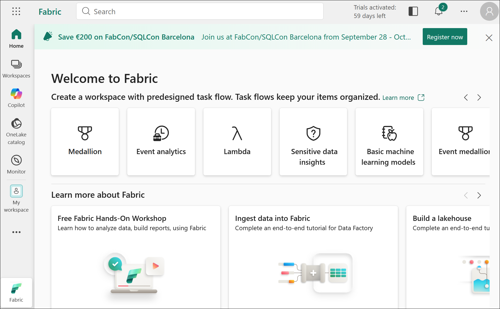

1. After activating the Fabric Trial, ensure that you are working in the **Microsoft Fabric** experience and not the Power BI experience. You can verify this from the experience selector in the portal before proceeding with the lab.

   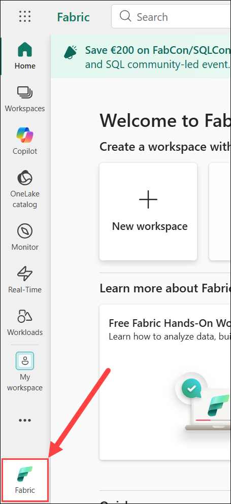

1. If the **Power BI** experience is currently selected, click on it and choose **Fabric** from the experience selector to switch to the Microsoft Fabric portal before proceeding with the lab.

   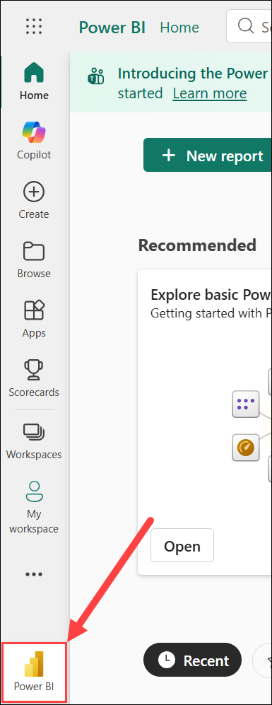

   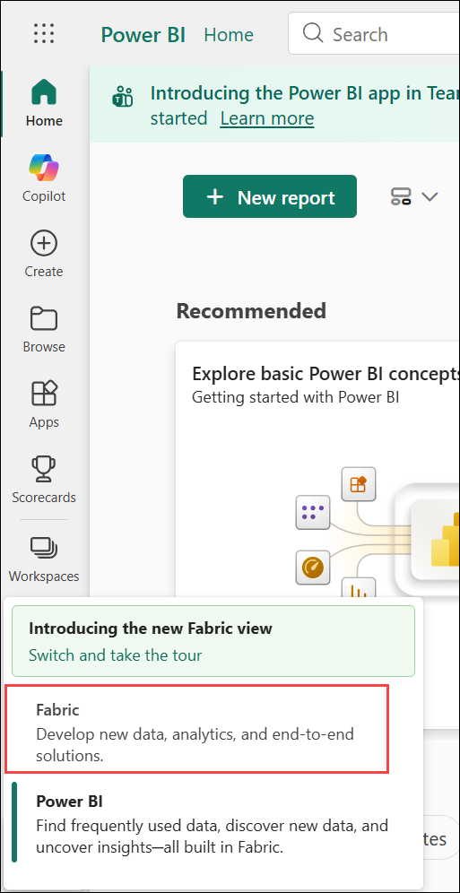

### Task 2: Create a workspace and link with Fabric Copilot-enabled capacity

In this task, you will create a new workspace and link it to the Copilot-enabled capacity that has been set up for you. 

1. Now let's create a workspace with a Fabric license. Select **Workspaces** **(1)** from the left navigation bar.

1. Click **+ New workspace (2)** found at the bottom of the pop-out menu.

   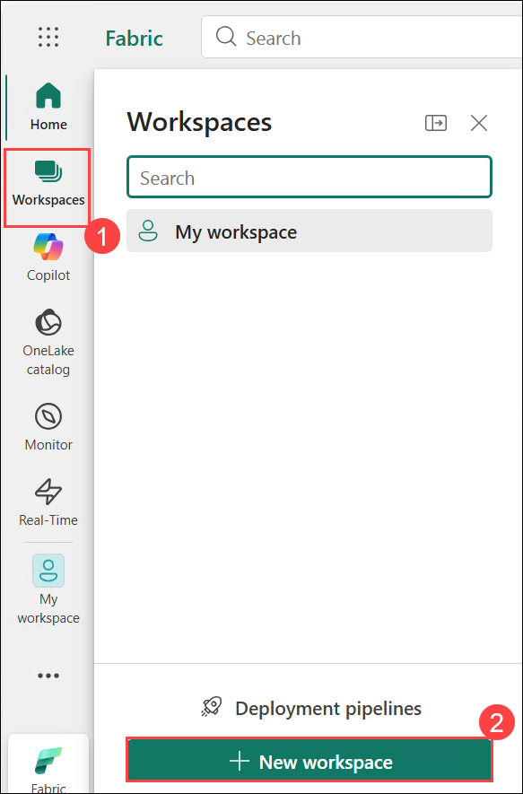

1. The **Create a workspace** dialog opens on the right side of the browser.

1. Enter the name as **Workspace<inject key="DeploymentID" enableCopy="false"/> (1)**, validate that the name is available, and then click **Advanced (2)**.

    >**Note:** Please use the workspace name provided above.

    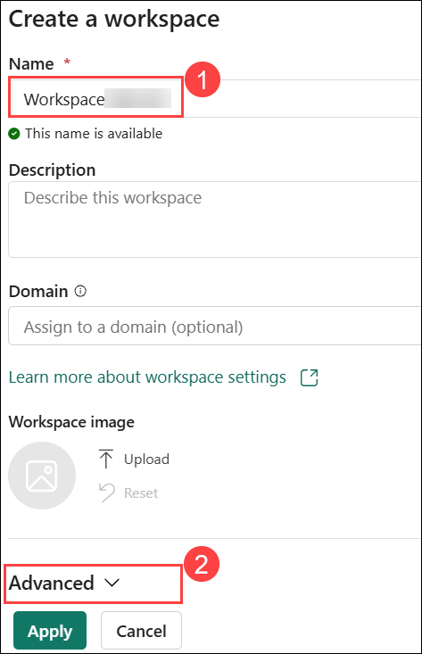

1. Ensure **Fabric (1)** is chosen, verify that **capacity<inject key="DeploymentID" enableCopy="false"/> (2)** is selected under **Details**, and then click **Apply (3)**.

   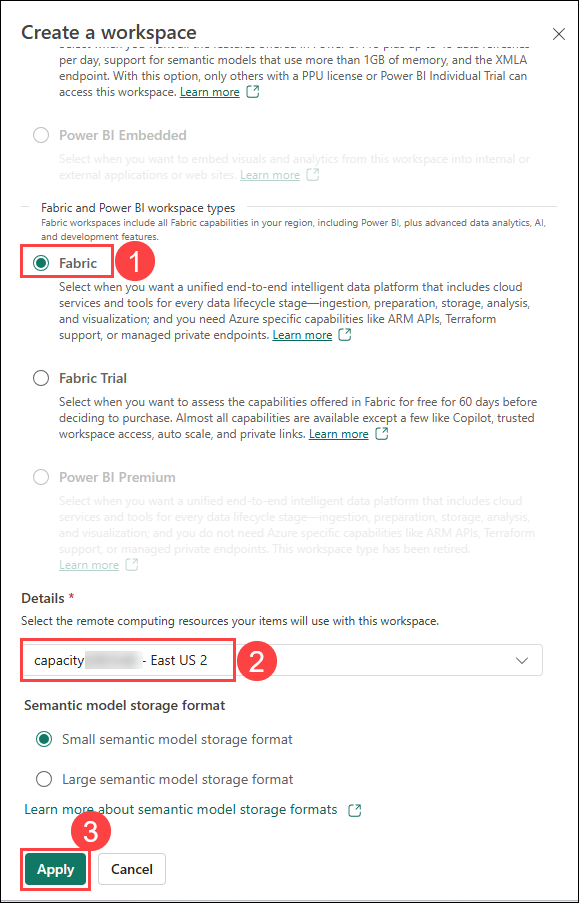

    >**Note:** Close any pop-up that appears on the screen.

    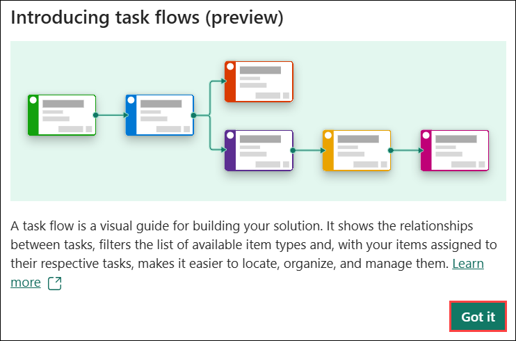

    >**Note:** Wait for the Power BI Workspace to load.

1. A new workspace has been created, and you will be able to navigate into this workspace. We will bring data from the different data sources into a Lakehouse and use the data from the Lakehouse to build our model and report on it.

> **Congratulations** on completing the task! Now, it's time to validate it. Here are the steps:
> - Hit the Validate button for the corresponding task. If you receive a success message, you can proceed to the next task. 
> - If not, carefully read the error message and retry the step, following the instructions in the lab guide.
> - If you need any assistance, please contact us at cloudlabs-support@spektrasystems.com. We are available 24/7 to help you out.
<validation step="bf14a857-da8b-49dc-9159-77cb14984ba3" />

## Summary

In this exercise, you have successfully activated the Microsoft Fabric free trial and created a new workspace linked to the Copilot-enabled capacity. This workspace will serve as the foundation for your data analytics and reporting activities in Microsoft Fabric. You are now ready to bring in data, build models, and generate insights using the powerful tools available in the platform.

#### You have successfully completed Exercise 1. Click on **Next** from the lower right corner to move on to the next page.

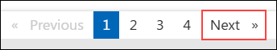