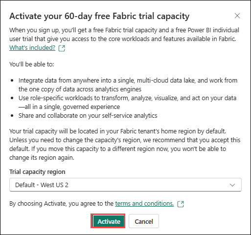
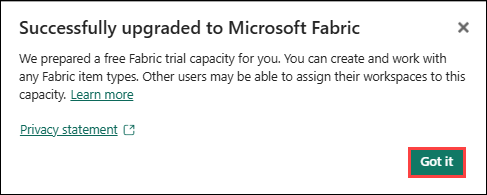

# Exercise 1: Getting Started with Microsoft Fabric: Set Up a Workspace.

## Estimated Duration: 30 minutes

## Lab Scenario

In this exercise, you will create a new workspace using the pre-deployed Fabric capacity. The workspace will be linked to a Copilot-enabled capacity, allowing you to prepare the environment for bringing in data, building models, and generating reports using Microsoft Fabric’s integrated tools.

## Objective

In this exercise, you will complete the following tasks:

- Task 1: Start Free fabric trial
- Task 2: Create a workspace and link with Fabric Copilot-enabled capacity

## Task 1: Start Free fabric trial

In this task, you will activate the free 60-day Microsoft Fabric trial. This trial provides access to Fabric’s powerful data analytics, integration, and visualization features, enabling you to explore and work with the platform without requiring an active license.

1. On the top right corner of the screen, select the **User icon (1)** and select **Free trial (2)**.

    

1. When **Activate your 60-day free Fabric trial capacity** dialog opens. Select **Activate**.

    

    > **Note:** The trial capacity region may differ from the one shown in the screenshot. No need to worry – simply use the default selected region, activate it, and continue to the next step.

1. On **Successfully upgraded to Microsoft Fabric** dialog. Select **Got it**.

    

1. You will be navigated to the **Microsoft Fabric Home page**.

    

    > **Note:** If the **Invite teammates to try Fabric to extend your trial** window appears, please close it.  

## Task 2: Create a workspace and link with Fabric Copilot-enabled capacity

In this task, you will create a new workspace in Microsoft Fabric to organize and manage your data and analytics assets. The workspace will be linked to a Copilot-enabled capacity, providing access to AI-powered features such as natural language queries and intelligent data insights.

1. Now let's create a workspace with a Fabric license. Select **Workspaces** **(1)** from the left navigation bar.

1. Click **+ New workspace (2)** found at the bottom of the pop-out menu.

    

1. The **Create a workspace** dialog opens on the right side of the browser.

1. Enter the name **Workspace<inject key="DeploymentID" enableCopy="false"/> (1)**, validate that the name is available, and then click **Advanced (2)**.

    >**Note:** Please use the workspace name provided above.

    

1. Ensure **Fabric capacity (1)** is chosen, verify that **capacity<inject key="DeploymentID" enableCopy="false"/> - <inject key="Region" enableCopy="false"/> (2)** is selected under **Capacity**, and then click **Apply (3)**.

    

    >**Note:** Close any pop-up that appears on the screen.

    

    >**Note:** Wait for the Power BI Workspace to load.

1. A new workspace has been created, and you will be able to navigate into this workspace. We will bring data from the different data sources into a Lakehouse and use the data from the Lakehouse to build our model and report on it.

> **Congratulations** on completing the task! Now, it's time to validate it. Here are the steps:
> - Hit the Validate button for the corresponding task. If you receive a success message, you can proceed to the next task. 
> - If not, carefully read the error message and retry the step, following the instructions in the lab guide.
> - If you need any assistance, please contact us at cloudlabs-support@spektrasystems.com. We are available 24/7 to help you out.
<validation step="bf14a857-da8b-49dc-9159-77cb14984ba3" />

## Summary

In this lab, you have completed the following tasks:
- Started Free fabric trial
- Created a workspace and linked with Fabric Copilot-enabled capacity

## You have successfully completed Exercise 1. Click on **Next** from the lower right corner to move on to the next page.

