# Exercise 2: Explore Copilot for Data Flows

## Estimated Duration: 120 Minutes

## Lab Scenario

In this exercise, you will use Microsoft Fabric Copilot to ingest, transform, and analyze data. You will load the Northwind dataset using Dataflow Gen2, then use Copilot in Power Query and notebooks to generate queries, summarize data, and create Python code, showcasing AI-assisted data analysis.

Microsoft has integrated Copilot and other generative AI features into Fabric to introduce new ways for you to transform and analyze data, generate insights and create visualizations and reports. You must
enable Copilot before you can use it. Copilot in Fabric is not available in all regions. In this activity, you will integrate Copilot for data analysis and visualization.

## Objectives

In this exercise, you will complete the following tasks:

- Task 1: Ingest the dataset via Data Pipelines to Lakehouse File Section
- Task 2: Exploring Copilot capabilities in Fabric notebooks

## Task 1: Ingest the dataset via Data Pipelines to Lakehouse File Section

In this task, you will ingest the dataset into the **Lakehouse File** section using Data Pipelines.

1. Ensure you're logged into your Fabric workspace before proceeding.

1. Click on **+ New item (1)** button. In the pop-up window, search for **Lakehouse (2)** in the search bar and click on **Lakehouse (3)**.

    

1. Enter the following details to create a new Lake house and click on **Create (4)**:

    - Name: **lakehouse<inject key="DeploymentID" enableCopy="false"/> (1)**
    - Location: **Workspace<inject key="DeploymentID" enableCopy="false"/> (2)**
    - Select the **Lakhouse schemas checkbox (3)**

        

1. You will be navigated to the newly created **Lakehouse**.

    >**Note:** If you see any pop-up tab like below you can close it for now.

    

1. From the **Lakehouse (1)** page, select **Get data (2)** from the toolbar, and then choose **New Dataflow Gen2 (3)**.

    
    
1. In the **Name** field enter **North Wind Data (1)** and click on **Create (2)**.

    

    > **Note:** The checkbox for **Enable Git Integration, deployment pipelines and Public API scenarios** is enabled by default ensure to keep it as it is.

1. On the **North Wind Data** page, go to the **Home** tab, and then select **Get data (1)** > **More (2)**.

    

    >**Note:** If you don't see the **Get Data** option, it might be because your browser is zoomed in you can either zoom out the browser or in that case, then select **Get Data (1) > More (2).**

1. In the **Choose data source** field, type **OData (1)** to filter the available data sources, and then select **OData (2)**.

    

1. In the **Connect to data source** window, under **Connection settings**, paste **https://services.odata.org/V4/Northwind/Northwind.svc/** **(1)** into the **URL** field, and then select **Next (2)**.

    
   
1. In the **Choose data** window, select the following seven tables **Customers**, **Employees**, **Order_Details**, **Orders**, **Products**, **Shippers**, **Suppliers**,**(1)** and then select **Create (2).** 

    

1. Ensure that **Lakehouse (1)** is selected as the **Data destination**. Hover over the **(i)** icon to view lakehouse details. To load the data, click the **Down arrow (2)** beside the **Save & run** button in the top-left corner, and then select **Save & run (3)** from the drop-down.

    

1. The query should look like the following:

    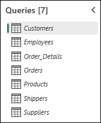

1. Navigate back to your workspace. Select **North Wind Data** dataflow that you have created.

    

    > **Note:** Please wait a few minutes until **North Wind Data** **Dataflow Gen2** becomes clickable.

1. Select the **Customers(1)** table, **scroll to the right(2)** and examine the **Country(3)** column. Notice that the countries include **Argentina** and **Mexico**.

    

1. On the **Power Query** toolbar, go to the **Home** tab, click the **>** option, and then select **Copilot** (if you don't see the Copilot option visible to you in the toolbar).

    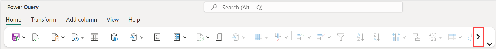

    

    > **Note:** If the **Copilot** option isn’t visible, try reducing your browser's zoom level.

    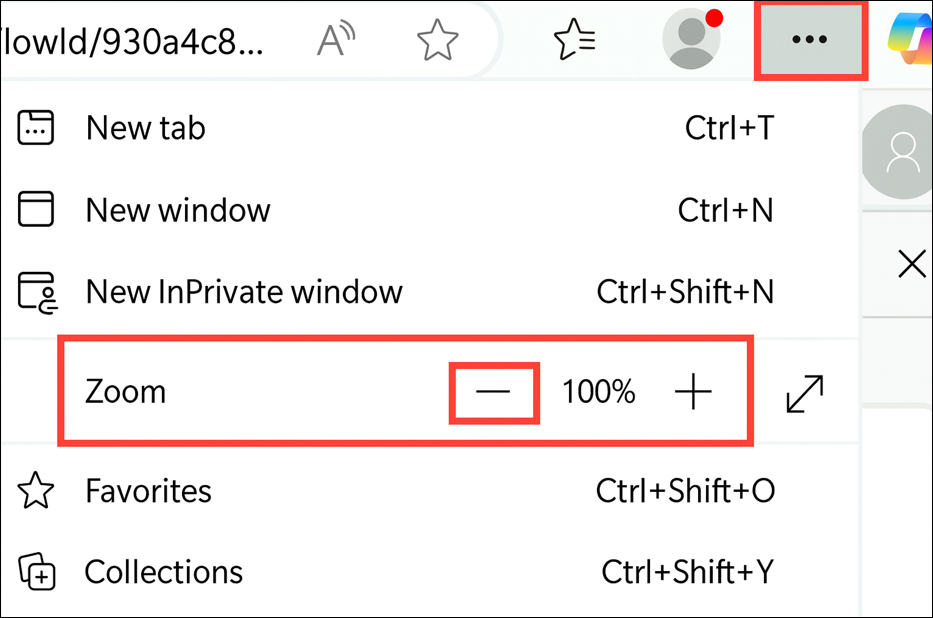

1. In the **Copilot** pane enter **Only show Countries Brazil and Venezuela (1)** and then select **Send (2)**.

    

    >**Note:** Due to the nature of Copilot, you may end up with differing results.

    The desired Applied Step text is :
    ```
    Table.SelectRows(#"Navigation 1", each [Country] = "Brazil" or [Country] = "Venezuela")
    ```

1. You will now see that the table has been updated to display only **Brazil and Venezuela**. The Country column has been filtered to include only customers from Brazil and Venezuela.

    

1. You can undo the step by selecting **Undo (1)** to revert the changes, as we want to use Copilot against the whole dataset. If the **Undo** option isn't visible, you can remove the filter by clicking the **x (2)** next to **Filter Rows**.

    

1. In the **Copilot** pane, enter **How many customers in each country?** and then select **Send**.

    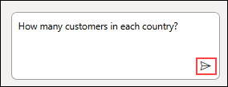

1. You will see the total customers present in each country. Sometimes, due to the nature of Copilot, you may end up with different results or errors.

    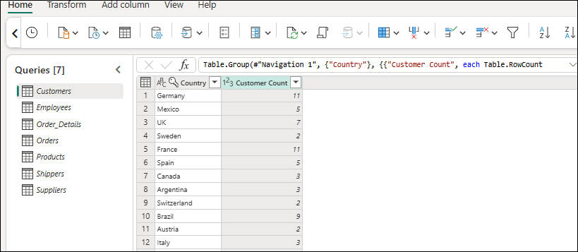

    >**Note:** You need to have an accurate question, so you can also try: **What is the total number of customers in each country?**

    The desired Applied Step text is :

    ```
    Table.Group(#"Navigation 1", {"Country"}, {{"CustomerCount", each Table.RowCount(_)}})
    ```

1. The query outputs a list displaying the number of customers per country.

    

1. You can undo the step by selecting **Undo (1)** to revert the changes, as we want to use Copilot against the whole dataset. If the **Undo** option isn't visible, you can remove the filter by clicking the **x (2)** next to **Group by**.

    

1. Select the **Order_Details** query from the left pane, then in the **Copilot** pane, enter **Only keep orders whose quantities are above the median value** and then select **Send**.

    

    

1. The **Quantity** column now displays all values above 20.

    

1. On the **Power Query** toolbar, on the **Home** tab, select **Advanced editor**.

    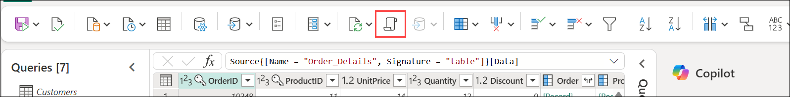

1. Review the definition of the formula used in the query.

1. Select **Cancel** to exit the Advanced editor without making changes.

    

    >**Note:** In the Advance editor, the query values might be different from the screenshot mentioned.

1. In the **Copilot** pane, select **Undo** to revert the changes.

    
   
1. In the **Copilot** pane, enter **Create a new query with data for official public holidays for Australia in 2024** and then select **Send**.

    

    

1. Australian public holidays have been added to the list. Review them as needed.

1. In the **Copilot** pane, select **Undo** to revert the changes.

    

1. In the **Copilot** pane, enter the following text: **Create a new query with average monthly temperatures for Spain between 2022 and 2025. Display the Months in columns** and then select **Send**

    

    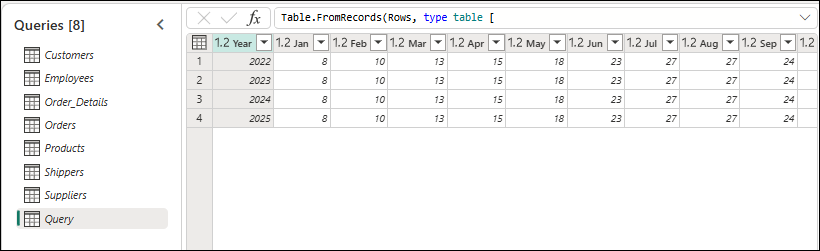

1. In the **Copilot** pane, select **Undo** to revert the changes.

    

1. Select the **Orders** query.

    

1. In the **Copilot** pane, enter the following text: **Create a new query named "Value By Delivery Country" showing the order value aggregated by shipCountry** and then select **Send**

    

1. A table containing the **shipCountry** and **Total Order value aggregates** is displayed.

    

1. On the **Power Query** toolbar, on the **Home** tab, select **Advanced editor** to verify the correct formula.

    

1. The value of Freight is being used. Should this be the intended behavior? Review Copilot's actions to confirm.

    

1. Select **Cancel** to close the **Advanced editor**, and then in the **Copilot** pane, select **Undo** to revert the changes.

    

    

1. Select **Customer** query then ensure that **Lakehouse** is selected as the **Data destination.**

    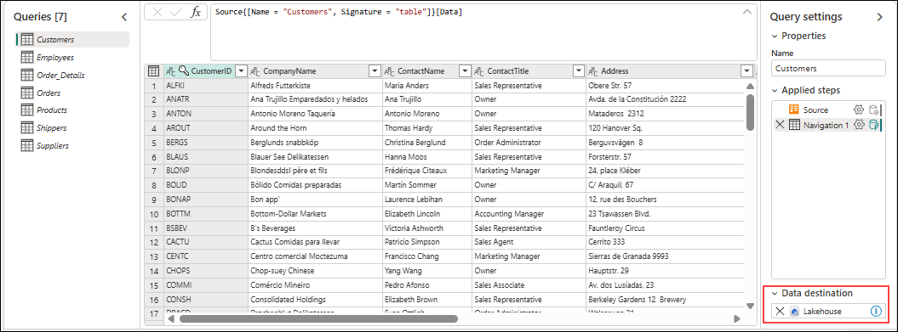

1. Click the **Down arrow** next to the **Save and Run (1)** icon, and then select **Save and Run (2)** to save your data to your Lakehouse. Make sure to select your target Lakehouse connection before saving. (Skip this step if you have already saved the dataset in an earlier step.)

     

> **Congratulations** on completing the task! Now, it's time to validate it. Here are the steps:
> - Hit the Validate button for the corresponding task. If you receive a success message, you can proceed to the next task. 
> - If not, carefully read the error message and retry the step, following the instructions in the lab guide.
> - If you need any assistance, please contact us at cloudlabs-support@spektrasystems.com. We are available 24/7 to help you out.
<validation step="a2c099c2-1da1-4240-8b09-280d6f094dba" />

## Task 2: Exploring Copilot capabilities in Fabric notebooks

In this task, you will explore Copilot capabilities in Fabric notebooks.

1. In the **Workspace<inject key="DeploymentID" enableCopy="false"/> (1)** Fabric workspace you created earlier, select the **lakehouse<inject key="DeploymentID" enableCopy="false"/> (2)** you previously created.
  
    

    >**Note:** Wait for the tables to load up before proceeding to the next steps.

1. On the **Fabric workshop Lakehouse**, use the menu bar to select **Open notebook (1)**, and then choose **New notebook (2)**.

    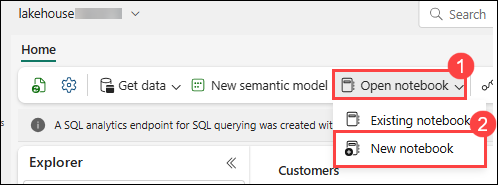

    >**Note:** If the tour pop-up appears, you can skip it for now by selecting **Skip tour**.

    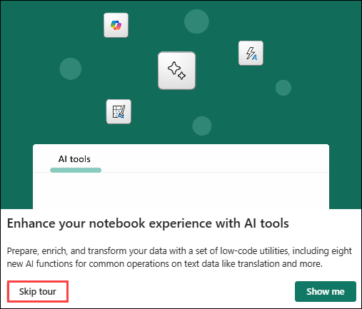

1. At the upper left of the page, select the notebook name **Notebook 1 (1)**. Replace it with **CopilotDemoNotebook (2)**, and press **Enter** on your **keyboard**.

    

1. From the notebook menu, click the **ellipsis (...) (1)**, and then select **Copilot (2)**.

    

    >**Note:** If the tour pop-up appears, feel free to skip it for now.

1. Click **Get Started (1)** in the Copilot tab, then select **Run cell (2)** button to initiate the session. Once the session has started, you can proceed to the next step.

    .png)

    >**Note:** As this is your first session, it may take a few minutes (around 1-2 minutes) to get started.
    
    >**Note:** If the cell output shows **InvalidHttpRequestToLivy**, click on the **... (ellipses)** beside the lakehouse in the left panel, select **Refresh**, and then **Run Cell** again.
    
    

1. Move the cursor to the lower left of the last cell in the notebook, and select **+ Code** to add a new cell.

    >**Note:** If you don’t see the + Code button, hover slightly below the last cell to reveal it.

    

1. Enter the following **code (1)** in the new cell and then select **Run cell (2)**.

    >**Note:** This code specifies Azure storage access and connectivity information for the NYC Yellow Taxi open dataset. The last line of code filters the data to limit the volume of data that you'll ingest for this exercise.

    >**Note:** Running the code may take 2–3 minutes. Please wait for it to complete.

    ```
    storage_account_name = "azureopendatastorage"
    container_name = "nyctlc"

    sas_token = r"" # Specify blank since container is public with anonymous access

    spark.conf.set("fs.azure.sas.%s.%s.blob.core.windows.net" % (container_name, storage_account_name),sas_token)

    directory = "yellow"
    year = 2016
    months = "1,2,3,4,5,6"
    wasbs_path = f"wasbs://{container_name}@{storage_account_name}.blob.core.windows.net/{directory}"
    nyc_yellowtaxi_df = spark.read.parquet(wasbs_path)

    filtered_nyc_yellowtaxi_df = nyc_yellowtaxi_df.filter(f"puYear = {year} AND puMonth IN ({months})")
    ```

    >**Warning:** As each cell runs, a message will indicate that Spark jobs are in progress. Once processing is complete, a message will confirm the success of the Spark jobs. If the code in a particular cell fails, processing for the other cells will not continue.

    

    > **Note:** To view the Spark jobs, expand the **Spark jobs** section as shown in the snapshot below.

    .png)

    .png)

1. Add another cell to the notebook. Add the following code to the new cell and then select the **Run cell** button. This code saves the data as a delta table in the Lakehouse.

    ```
    table_name = "nyc_yellowtaxi_raw"

    filtered_nyc_yellowtaxi_df.write.mode("overwrite").format("delta").saveAsTable(f"{table_name}")
    print(f"Spark dataframe (filtered_nyc_yellowtaxi_df) saved to a delta table: {table_name}")
    ```

    

    >**Note:** It may take around 1-2 minutes to run the above notebook code.

1. Add another cell to the notebook. Add the following code to the new cell and then select the **Run cell** button. This code runs a query to select and aggregate data.

    ```
    %%sql
    select puYear, puMonth, count(*) from nyc_yellowtaxi_raw group by puYear, puMonth order by puYear, puMonth
    ```

    >**Note:** The output dataset from the query should contain 6 rows, with each row showing the year, month, and the number of records for that period.

    

1. Add another cell to the notebook. Add the following code to the new cell and then select the **Run cell** button. This code counts the number of records returned.

     ```
     filtered_nyc_yellowtaxi_df.count()
     ```

    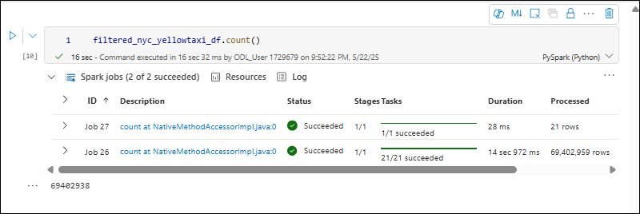

    >**Note:** During testing, 69,402,938 rows were returned.

1. At the bottom of the Copilot pane, enter the prompt **Describe the structure of the filtered_nyc_yellowtaxi_df dataframe** and then select **Enter**.

    

    

    >**Note:** The output may differ from what is shown in the screenshot.

    >**Warning:** Copilot for Fabric notebooks is in preview. During lab testing, we experienced mixed results when we submitted this prompt. In some cases, Copilot responds with a Python command that you can enter in a cell to describe the dataframe structure. The command should resemble the following:

    ```
    filtered_nyc_yellowtaxi_df.describe().show()
    ```

1. In other cases, Copilot responded with **I'm unable to provide a description without more context or the structure of the dataset** or **I must decline to assist with that request**. These issues should be resolved as this Copilot evolves.

1. If Copilot does not create a command for you, add a new cell to the notebook. Add the following code to the new cell and then select the **Run cell** button:

    ```
    filtered_nyc_yellowtaxi_df.describe().show()
    ```

    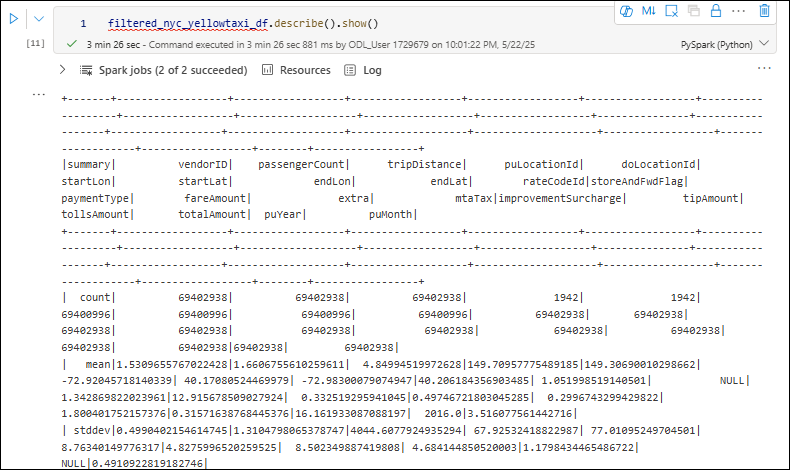

    

    > **Note:** Running the code may take 2–3 minutes. Please wait for it to complete.

1. At the bottom of the **Copilot** pane, enter the following prompt and then select **Enter**. Copilot should respond with a command that you can run to create the dataframe.

    ```
    Create a dataframe by loading data from nyc_yellowtaxi_raw table and sampling it with 1 percentage, count the rows in the dataframe and show the amount.
    ```

1. Select **Insert code(1)** to create a new cell in the Notebook. Run the cell:

    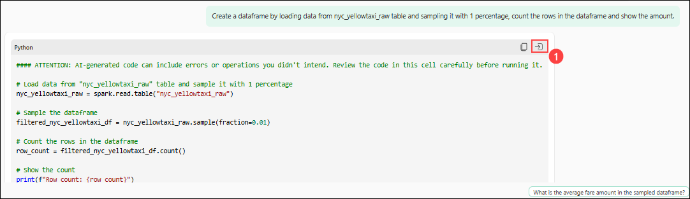

    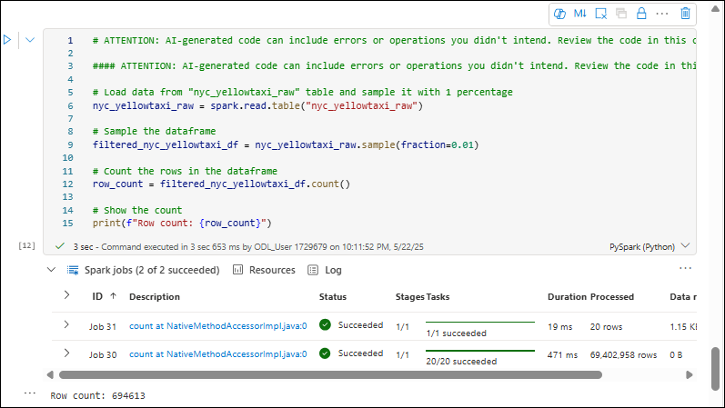

    > **Note**: If you do not see the **Insert Code** option copy the code generated by Copilot, add a new cell in the notebook and paste it, then click on **Run Cell**

1. If Copilot does not create the command for you, add a new cell to the notebook. Then, add the following code to the new cell and then select the **Run cell** button.

    ```
    %%code
    Create a dataframe by loading data from nyc_yellowtaxi_raw table and sampling it with 1 percentage, count the rows in the dataframe and show the amount.
    ```

    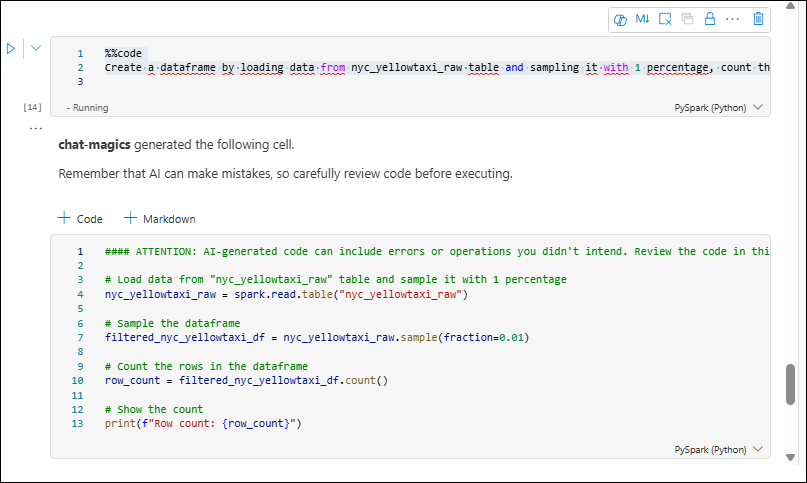

1. If you encounter any issues creating the command with Copilot or see errors in the results, you can use the code below, which was generated by Copilot while testing the functionality. Add the following code to the new cell and then select the **Run cell** button.

    ```
    # ATTENTION: AI-generated code can include errors or operations you didn't intend. Review the code in this cell carefully before running it.

    # Load the table into a DataFrame
    nyc_yellowtaxi_raw_df = spark.read.table("nyc_yellowtaxi_raw")

    # Sample 1% of the data
    sampled_df = nyc_yellowtaxi_raw_df.sample(0.01)

    # Count the rows in the sampled dataframe
    row_count = sampled_df.count()

    # Show the row count
    print(f"Number of rows in the sampled dataframe: {row_count}")
    ```

    

    **Important:** To learn more about Chat-Magics, go to [Overview of chat-magics in Microsoft Fabric notebook](https://learn.microsoft.com/en-us/fabric/get-started/copilot-notebooks-chat-magics)

## Summary

In this exercise, you have completed the following tasks:

- Ingested the dataset via Data Pipelines to Lakehouse File Section
- Explored Copilot capabilities in Fabric notebooks

You have successfully completed Exercise 2. Click on **Next** from the lower right corner to move on to the next page.


