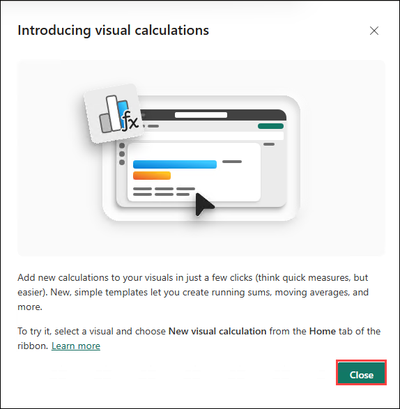
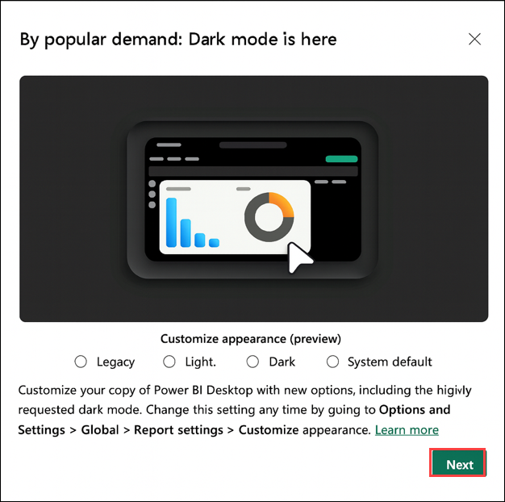
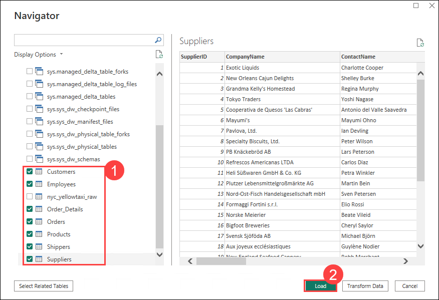
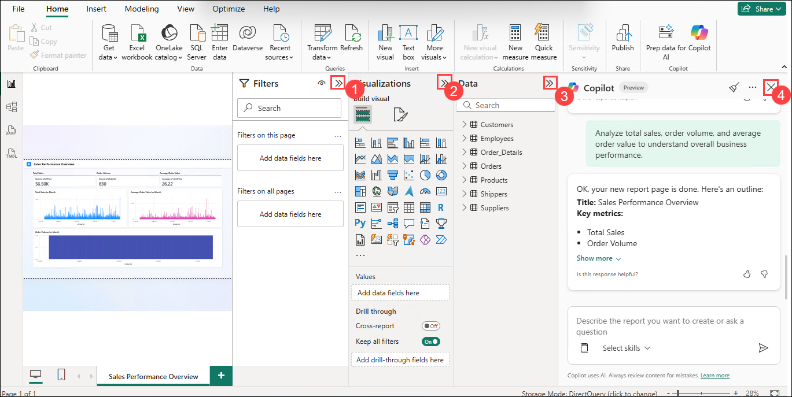
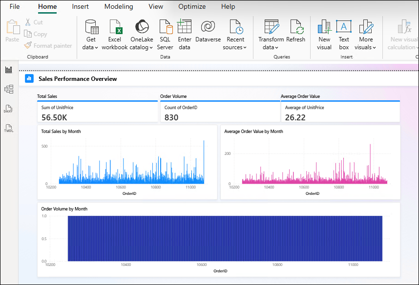
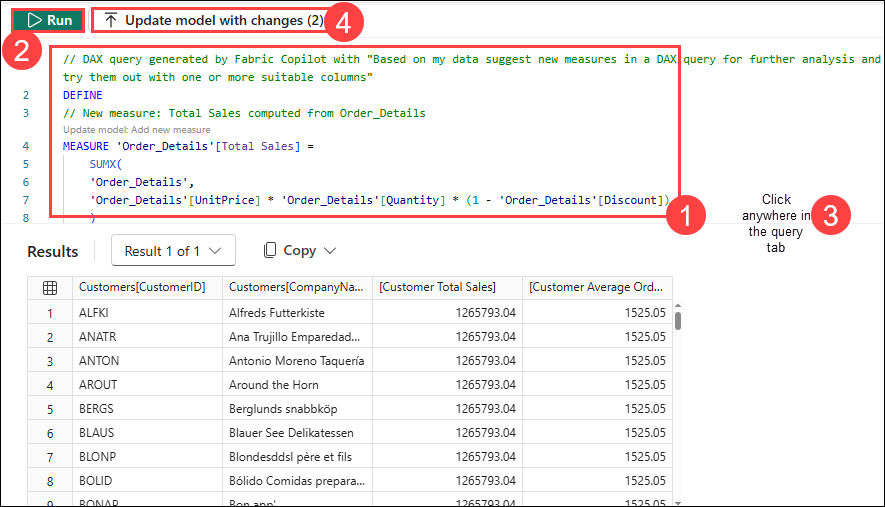
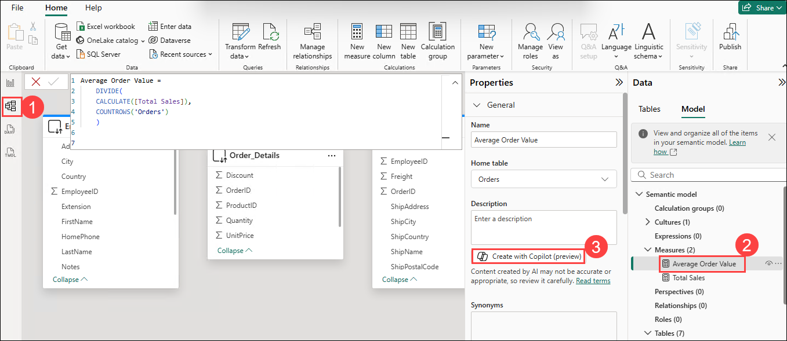
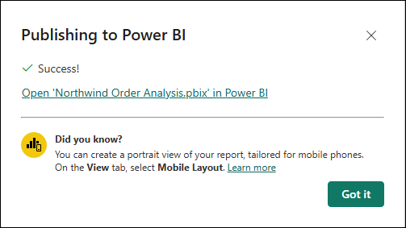
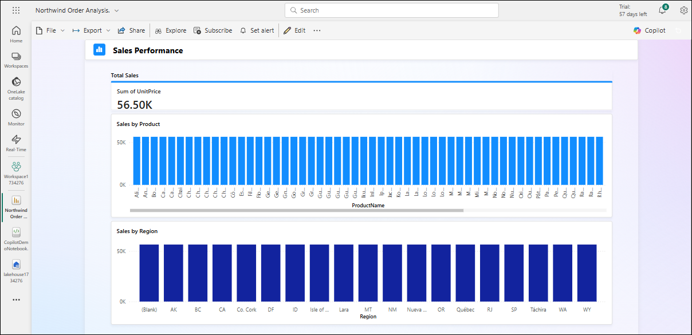
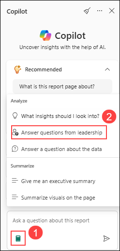

# Exercise 3: Visualizing and gaining Insights using Copilot for Power BI

## Estimated Duration: 1 Hour 30 minutes

## Lab Scenario

In this exercise, you will use Copilot for Power BI to connect to a Microsoft Fabric dataset, generate visual reports, create and describe DAX measures, and gain insights using natural language prompts. You’ll build a report from a Lakehouse, use Copilot to summarize data, generate report content, suggest measures, and publish the report to the Power BI service. Finally, you will explore the report as a consumer, using Copilot to summarize visuals and answer leadership questions.

Let's leverage Copilot for Power BI to create interactive reports using curated data stored in OneLake. This exercise will guide you through the end-to-end process: connecting to your dataset, using Copilot for Power BI to explore data, and generating insightful visualizations with minimal manual effort.

**Power BI:** This integration incorporates generative AI to automatically build reports based on topics you select or prompts you create.

## Objectives

In this exercise, you will complete the following tasks:

- Task 1: Connect to a Fabric dataset and create visualizations using Copilot
- Task 2: Create DAX queries and update measure descriptions using Copilot
- Task 3: Explore Copilot for Power BI as a report consumer

## Task 1: Connect to a Fabric dataset and create visualizations using Copilot

In this task, you will connect to a Fabric dataset to access and explore structured data. Using Microsoft Fabric Copilot, you will generate visualizations by simply describing the insights you need. This enables quick, AI-assisted data analysis and streamlined report creation.

1. Launch the **Power BI** application by double clicking the desktop shortcut icon.

    

1. Click on **Sign in (1)** from the upper right corner of the application. Provide Email: **<inject key="AzureAdUserEmail" enableCopy="true"/> (2)** then click **Continue (3)**.

    

1. On the **Sign in to Microsoft** tab, you will see a login screen. Enter the following email and then click on **Next**.

    - Email: **<inject key="AzureAdUserEmail" enableCopy="true"/>** 
   
      
     
1. Now enter the following password and click on **Sign in**.

    - Enter password: **<inject key="AzureAdUserPassword" enableCopy="true"/>**
   
        

1. On the **Automatically sign in to all desktop apps and websites on this device** pop-up, click on **No, this app only**.

    

1. Select **Blank Report** to create a new dashboard. 

     

    >**Note:** If you receive any pop-ups, please **Close** them.

    

    

1. Select **Get Data** **-> (1)** **More...(2)** to connect to the dataset needed for your report.

     

1. Select **Microsoft Fabric (1)** and then select **Lakehouses (2) -> Connect (3)**

    

1. Select the **lakehouse<inject key="DeploymentID" enableCopy="false"/> (1)** created in the earlier exercise and select **Connect to SQL endpoint (3)** by selecting the arrow next to **Connect (2)**.

    

1. Then, log in using the credentials provided below.

    - Email: **<inject key="AzureAdUserEmail" enableCopy="true"/>**

    - Enter password: **<inject key="AzureAdUserPassword" enableCopy="true"/>**

1. A navigator window appears to select the targeted dataset. Select the following entities and then select **Load:**

    **Customers, Employees, Orders, Order_Details, Products, Shippers, Suppliers**

    

1. Create a real-time connection to your Lakehouse by selecting **DirectQuery (1)** then **OK (2)**.

    

1. On the Home menu, click on **Copilot**.

    

    >**Note:** If you're unable to find Copilot, try zooming out the browser tab to 80% - it should then become visible.

1. Select the workspace **Workspace<inject key="DeploymentID" enableCopy="false"/> (1)** and click **Select workspace (2)**.

    

1. Click **Get started** in the Copilot chat window.

    

1. Once connected, let's use Copilot to summarize our data. Select the **Prompt Guide (1)**, then select **"Give me an executive summary" (2)**

    

    

    >**Note**: If you don’t get a result the first time, repeat the steps few times by selecting **Prompt Guide (1)**, then **"Give me an executive summary" (2)** to generate the result.

1. Select the **Prompt Guide (1)**, then select **"Suggest content for a new report page" (2)** based on the semantic model.

    
   
1. Select **+ Create (1)** under **Sales Performance** to generate a report analyzing order details, unit prices, and quantities sold.

    

    > **Note:** Copilot’s suggestions may vary. Please proceed by creating whatever Copilot suggests, even if it differs from the example shown.

1. To view the chart clearly after generating the report, minimize the **Filters (1)**, **Visualizations (2)**, and **Data (3)** panes, and close the **Copilot Suggestions (4)** tab. 

    

    

    > **Note:** Copilot’s suggestions may vary. Please proceed by creating whatever Copilot suggests, even if it differs from the example shown.

## Task 2: Create DAX queries and update measure descriptions using Copilot

In this task, you will use DAX Query Copilot to extend your dataset with new calculations and improve documentation. Copilot will help you generate a new measure for **Total Sales after Discount** and update the description of an existing measure to ensure clarity and consistency.

1. In the **Power BI** from the left pane select the **Dax query view (1)**. Select **Copilot (Preview) (2)** then select **Suggest measures** option.

    

    >**Note:** Close any pop-up that appears on the screen.

    

    >**Note:** If you get pop up something went wrong, close it and continue from the next step.

1. Once the measure has been generated, verify it and click **Discard query** for now as it would create different code for every users.

     

     >**Note:** Exit copilot by clicking on the **x** icon. When the **Exit Copilot?** window pops up, click **Yes** to exit.

     

     

1. To proceed, copy the code provided below and paste it into the **query box (1)**. 

    ```
    // DAX query generated by Fabric Copilot with "Based on my data suggest new measures in a DAX query for further analysis and try them out with one or more suitable columns"
    DEFINE
    // New measure: Total Sales computed from Order_Details
    MEASURE 'Order_Details'[Total Sales] =
        SUMX(
        'Order_Details',
        'Order_Details'[UnitPrice] * 'Order_Details'[Quantity] * (1 - 'Order_Details'[Discount])
        )
    
    // New measure: Average Order Value computed at the Order level
    // Assumes each order aggregates its Order_Details' Total Sales.
    MEASURE 'Orders'[Average Order Value] =
        DIVIDE(
        CALCULATE([Total Sales]),
        COUNTROWS('Orders')
        )

    EVALUATE
    // Summarize by Customer to try out the new measures with a suitable column 
    // (here Customers[CompanyName] is used to identify each customer).
    SUMMARIZECOLUMNS(
        Customers[CustomerID],
        Customers[CompanyName],
        "Customer Total Sales", CALCULATE([Total Sales]),
        "Customer Average Order Value", CALCULATE([Average Order Value])
    )
    ORDER BY Customers[CompanyName] ASC
    ```

1. Now, you can **Run (2)** the query to see the results of the query generated. Then, **select anywhere (3)** on the query tab to make the **Update model with changes** button enables and then click **Update model with changes (4)** to generate measures in **Model**.

    

1. Then, on the **Are you sure?** tab, select **Update model**.

    

    >**Note:** You may need to wait for 1-2 minutes for **Update model with changes** option to be enabled after running the query.

    >**Note:** Since these are **Copilot** suggested measures, they might differ from the screenshots shown in the guide.

1. In the **Data** window, select the **Model (1)** tab and notice the two measures created. Expand **Measures (2)** and review the **list of measures (3)**.

    
   
    > **Note:** Copilot’s suggestions may vary. Please proceed by creating whatever Copilot suggests, even if it differs from the example shown.

1. Navigate to the **Model view (1)** on the left pane and select the New measure **Average order value (2)** created. Navigate to the **Properties** section for the model and select **Create with Copilot (preview) (3).** Copilot generates a new measure description in a few seconds.

    

1. Review the measure **Description** to ensure that it aligns with your model. Select **Keep it** to save the description.

    

1. You will observe that the **Description** has been automatically added by Copilot.

    

1. Now, let's publish the report to the Power BI service so that consumers can visualize and derive insights from it.

1. Select **Home (1)** and then select **Publish (2).** 

    

1. Select **Save**.

    

1. Save the report as **Northwind Order Analysis (1)** then click on **Save (2)**.   

    

1. Select **Workspace<inject key="DeploymentID" enableCopy="false"/> (1)** and click **Select (2)** to publish it under the workspace.

    

1. After the report gets published, you will see the Success pop-up window.

    

## Task 3: Explore Copilot for Power BI as a report consumer

In this task, you will explore Copilot for Power BI from a report consumer’s perspective. Copilot allows you to ask natural language questions directly within a report and receive instant insights. This helps you quickly understand data trends, summaries, and key metrics without the need to write complex queries.

1. Open a new tab in **Microsoft Edge**, and navigate to **Microsoft Fabric** by pasting the following **URL** into the address bar (if it is not already open).

    ```
    https://app.fabric.microsoft.com/
    ```

1. Navigate to your workspace and then select the **Northwind Order Analysis** report. You will see the visual report displayed on the screen :

    

    

1. Select the **Copilot** logo on the top-right and click on **Get started** to open the prompt guide. 

    

    

1. Select **Prompt guide (1)** then click **Summarize visual on the page (2)** to gain insights from each visual. The output you observe should resemble the example below:

    

    

1. Again, select **Prompt guide (1)** then click **Answer questions from leadership (2)** to prepare for your upcoming meeting with leadership. The output you observe should resemble the example below.

    

    

1. Ask Copilot to generate a report to monitor the current inventory by submitting the following prompt: **Create a report monitoring the product inventory.**

    

    >**Note**: If you see a message saying "To help me respond to requests like this, turn on Q&A for this semantic model," please click it to enable Q&A. Then, paste the query again.

1. You can follow the prompts to generate the report. Make sure to save the report if you want to access it later with the most recent updates.

## Summary

In this exercise, you have completed the following tasks:

- Connected to a Fabric dataset and created visualizations using Copilot
- Created DAX queries and updated measure descriptions using Copilot
- Explored Copilot for Power BI as a report consumer

By completing this lab **Fabric Copilot** , you gained hands-on experience in building AI-assisted data analytics workflows. Beginning with activating free trial of Microsoft Fabric and creating a workspace linked to Copilot-enabled capacity (F64), you ingest datasets into the Lakehouse using Data Pipelines and Dataflow Gen2. Leveraging Copilot in Power Query and notebooks, you generate queries, summarize data, and create Python code for AI-assisted analysis. You then connect to Fabric datasets in Power BI, where Copilot helps generate visualizations, write DAX queries, and update measure descriptions. Finally, you publish interactive reports, explore them as a consumer with Copilot-driven insights, and experience how Microsoft Fabric integrates generative AI to transform data preparation, analysis, and visualization into a streamlined, intelligent workflow.

## You have successfully completed the lab!