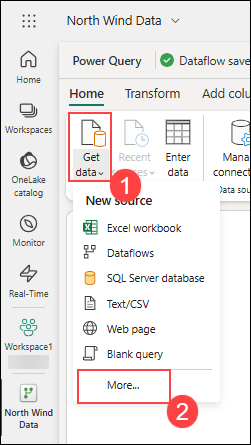
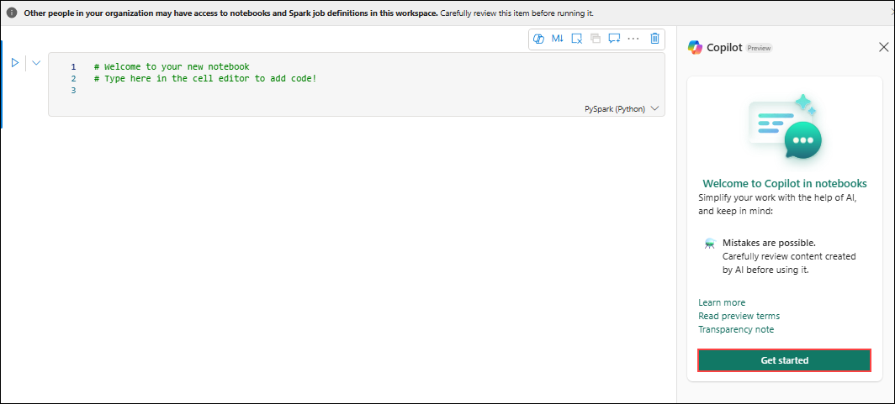
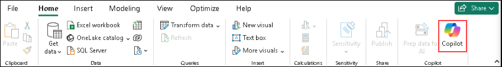
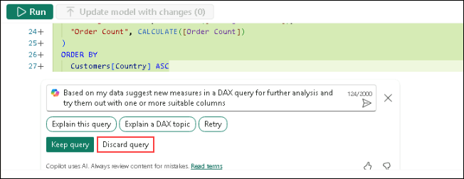

# Fabric Copilot Hands-On Lab

## Lab Overview

This hands-on lab provides comprehensive training on leveraging Microsoft Fabric and Copilot capabilities for data ingestion, preparation, and visualization. Participants will create and set up a Fabric workspace, including starting a free trial and linking it with Copilot-enabled capacity (F2). They will ingest datasets into the Lakehouse via Data Pipelines, explore Copilot’s AI-assisted features in Fabric notebooks, and connect to Fabric datasets to generate visualizations in Power BI using Copilot. Additionally, participants will use Copilot to write DAX queries, update measure descriptions, and optionally explore Copilot as a report consumer, gaining a solid understanding of its potential across the data and analytics workflows in Microsoft Fabric.

## Lab objectives

In this lab, you will complete the following exercises:

- Exercise 1: Create and set up Fabric Workspace 

- Exercise 2: Explore Copilot for Data Flows

- Exercise 3: Visualizing and gaining Insights using Copilot for Power BI

## Exercise 1: Getting Started with Microsoft Fabric: Activate Trial and Set Up a Workspace

### Task 1: Start Free fabric trial

1. On the top right corner of the screen, select the **User icon** and select **Free trial**.

    .png)

1. On Activate your 60-day free Fabric trial capacity dialog opens. Select **Activate**.

    

    > **Note:** The trial capacity region may differ from the one shown in the screenshot. No need to worry – simply use the default selected region, activate it, and continue to the next step.

1. Successfully upgraded to Microsoft Fabric dialog opens. Select **Got it**.

    .png)

1. You will be navigated to the **Microsoft Fabric Home page**.

    

### Task 2: Create a workspace and link with Fabric Copilot-enabled capacity

1. Now let's create a workspace with a Fabric license. Select **Workspaces** **(1)** from the left navigation bar.

2. Click **+ New workspace (2)** found at the bottom of the pop-out menu.

    

3. **Create a workspace** dialog opens on the right side of the browser.

4. Type the name **Workspace<inject key="DeploymentID" enableCopy="false"/> (1)**, validate the availability of the name, and click on **Advanced (2)**.

    >**Note:** Only use the workspace name provided above.

    

5. Ensure **Fabric capacity (1)** is enabled, verify that **capacity<inject key="DeploymentID" enableCopy="false"/> - <inject key="Region" enableCopy="false"/> (2)** is selected under **Capacity**, and then click **Apply (3)**.

    

    >**Note:** Close any pop-up that appears on the screen.

    

    >**Note:** Wait for the Power BI Workspace to load.

1. A new workspace has been created, and you will be able to navigate into this workspace. We will bring data from the different data sources into a Lakehouse and use the data from the Lakehouse to build our model and report on it.

## Exercise 2: Explore Copilot for Data Flows

Microsoft has integrated Copilot and other generative AI features into
Fabric to introduce new ways for you to transform and analyze data,
generate insights, and create visualizations and reports. You must
enable Copilot before you can use it. Copilot in Fabric is not available
in all regions. In this activity, you will integrate Copilot for data
analysis and visualization.

### Task 1: Ingest the dataset via Data Pipelines to Lakehouse File Section

In this task, you will ingest the dataset into the **Lakehouse File** section using Data Pipelines.

1. Ensure you're logged into your Fabric workspace before proceeding.

1. Click on **+ New item (1)** button. In the pop-up window, search for **Lakehouse (2)** in the search bar and click on **Lakehouse (3)**.

    

1. Copy the name **lakehouse<inject key="DeploymentID" enableCopy="false"/> (1)** and paste it in the **Name** field. Click on the **Lakehouse schemas (2)** checkbox and then click on the **Create (3)** button.

    

1. You will be navigated to the newly created lakehouse.

1. From the lakehouse page, select the **Get data (1)** option from the toolbar and select **New Dataflow Gen2 (2)** option.

    

1. Select the **Dataflow Gen2** in the menu, select the **Dataflow 1 (1)** then in the **Name** field, enter **North Wind Data (2)** and then press **Enter** from the keyboard.

    

1. On the **North Wind Data** dataflow gen2 **Home** tab, select **Get data (1)** >> **More (2)**.

    

1. In the **Choose data source** field, enter **OData (1)** to filter the possible data sources, and then select **OData (2).**

    

1. In the **Connect to data source** window, under **Connection settings**, in the **URL** field, copy and paste **https://services.odata.org/V4/Northwind/Northwind.svc/** and then select **Next.**

    

1. In the **Choose Data** window, select the following seven tables **Customers**, **Employees**, **Order_Details**, **Orders**, **Products**, **Shippers**, **Suppliers**, and then select **Create.** 

    

1. Check that the **Lakehouse (1)** selected is the one you created previously in the lab. You can hover over the **(i)** box to see the lakehouse details. Load the data to the Lakehouse by selecting **Publish (2)**.

    

1. The query should look like the following:

    

1. You will be navigated to your workspace. Select **North Wind Data** dataflow that you have created.

    

1. Select the **Customers** table, scroll to the right and examine the **Country** column. Notice that the countries include **Argentina** and **Mexico**.

    

1. On the **Power Query** toolbar, on the **Home** tab select **Copilot**.

    

    >**Note:** If the Copilot option isn't visible, try zooming out in your browser.

1. In the **Copilot** pane enter **Only keep South American customers** and then select **Send**.

    

    >**Note:** Due to the nature of Copilot, you may end up with differing results. You can also try **Only keep customers from South American countries**.

    The desired Applied Step text is :
    ```
    Table.SelectRows(#"Navigation 1", each List.Contains({"Mexico", "Brazil", "Argentina", "Chile", "Peru", "Colombia", "Venezuela", "Ecuador", "Bolivia", "Paraguay", "Uruguay", "Guyana", "Suriname"}, [Country]))
    ```

1. It will select Mexico only:

    

1. You can undo the step by selecting **Undo**. Afterwards, type: **Only keep South American customers**. If this step returns Mexico only, then insert the following step in the **transformation** tab:

    ```
    Table.SelectRows(#"Navigation 1", each List.Contains({"Mexico", "Brazil", "Argentina", "Chile", "Peru", "Colombia", "Venezuela", "Ecuador", "Bolivia", "Paraguay", "Uruguay", "Guyana", "Suriname"}, [Country]))
    ```

    

1. The **Country** column has been filtered and now only includes customers from South America.

    

1. In the **Copilot** pane, select **Undo** to revert the changes, as we want to use Copilot against the whole dataset.

    

1. In the **Copilot** pane, enter **How many customers in each country?** and then select **Send**.

    

1. Sometimes, due to the nature of Copilot, you may end up with different results or errors. Select **Undo** in the Copilot chat.

    

    

    >**Note:** You need to have an accurate question, so you can also try: **What is the total number of customers in each country?**

    The desired Applied Step text is :

    ```
    Table.Group(#"Navigation 1", {"Country"}, {{"Total Customers", each Table.RowCount(_)}})
    ```

1. The query outputs a list displaying the number of customers per country.

    

1. In the **Copilot** pane, select **Undo** to revert the changes.

    

1. Select the **Order_Details** query, then in the **Copilot** pane, enter **Only keep orders whose quantities are above the median value** and then select **Send**.

    

1. The **Quantity** column now displays all values above 20.

    

1. On the **Power Query** toolbar, on the **Home** tab, select **Advanced editor** under **Query** section.

    

1. Review the definition of the formula used in the query.

1. Select **Cancel** to exit the Advanced editor without making changes.

    

1. In the **Copilot** pane, select **Undo** to revert the changes.

    

1. In the **Copilot** pane, enter **Create a new query with data for official public holidays for Australia in 2024** and then select **Send**.

    

    

1. Australian public holidays have been added to the list. Review them as needed.

1. In the **Copilot** pane, select **Undo** to revert the changes.

    

1. In the **Copilot** pane, enter the following text: **Create a new query with average monthly temperatures for Spain between 2022 and 2025. Display the Months in columns** and then select **Send**

    

    

1. In the **Copilot** pane, select **Undo** to revert the changes.

    

1. Select the **Orders** query.

1. In the **Copilot** pane, enter the following text: **Create a new query named "Value By Delivery Country" showing the order value aggregated by shipCountry** and then select **Send**

    

1. A table containing the **shipCountry** and **Order value aggregates** is displayed.

    

1. On the **Power Query** toolbar, on the **Home** tab, select **Advanced editor** under **Query** section to verify the correct formula.

    

1. The value of Freight is being used. Should this be the intended behavior? Review Copilot's actions to confirm.

    

1. Select **Cancel** to close the Advanced editor, and then in the **Copilot** pane, select **Undo** to revert the changes.

1. Check the destination location of the dataset in the bottom right corner. 

    

1. Select **Publish** to publish your data to your lake house. Select your target Lakehouse connection before publishing. (Skip this step if you already published the dataset in an earlier step.)

### Task 2: Exploring Copilot capabilities in Fabric notebooks

In this task, you will explore Copilot capabilities in Fabric notebooks.

1. Open a new browser tab and go to [PowerBI](https://app.powerbi.com/)

1. In the lower left of the navigation pane for the workspace, select **Fabric**.

1. Open the **Workspace<inject key="DeploymentID" enableCopy="false"/>** fabric training workspace that you created previously. Then, select the **lakehouse<inject key="DeploymentID" enableCopy="false"/>** you created previously.

1. On the menu for the Fabric workshop Lakehouse, select **Open notebook** >> **New notebook**.

    

    >**Note:** If tour pop-up appears, feel free to skip it for now.

    

1. At the upper left of the page, select the notebook name. Replace the name with **CopilotDemoNotebook** and select **Enter** from keyboard.

    

1. From the notebook menu, select **Copilot**.

    

    >**Note:** If tour pop-up appears, feel free to skip it for now.

1. Click **Get Started** in the Copilot tab, then select **Run cell** button to initiate the session. Once the session has started, you can proceed to the next step.

    

    >**Note:** As this is your first session, it may take a few minutes (around 5–10 minutes) to get started.

1. Move the cursor to the lower left of the last cell in the notebook and select **+ code** to add a new cell.

    

1. Enter the following **code (1)** in the new cell and then select **Run cell (2)**.

    >**Note:** This code specifies Azure storage access and connectivity information for the NYC Yellow Taxi open dataset. The last line of code filters the data to limit the volume of data that you'll ingest for this exercise.

    ```
    storage_account_name = "azureopendatastorage"
    container_name = "nyctlc"

    sas_token = r"" # Specify blank since container is public with anonymous access

    spark.conf.set("fs.azure.sas.%s.%s.blob.core.windows.net" % (container_name, storage_account_name),sas_token)

    directory = "yellow"
    year = 2016
    months = "1,2,3,4,5,6"
    wasbs_path = f"wasbs://{container_name}@{storage_account_name}.blob.core.windows.net/{directory}"
    nyc_yellowtaxi_df = spark.read.parquet(wasbs_path)

    filtered_nyc_yellowtaxi_df = nyc_yellowtaxi_df.filter(f"puYear = {year} AND puMonth IN ({months})")
    ```

    >**Warning:** As each cell runs, a message will indicate that Spark jobs are in progress. Once processing is complete, a message will confirm the success of the Spark jobs. If the code in a particular cell fails, processing for the other cells will not continue.

    

1. Add another cell to the notebook. Add the following code to the new cell and then select the **Run cell** button. This code saves the data as a delta table in the Lakehouse.

    ```
    table_name = "nyc_yellowtaxi_raw"

    filtered_nyc_yellowtaxi_df.write.mode("overwrite").format("delta").saveAsTable(f"{table_name}")
    print(f"Spark dataframe (filtered_nyc_yellowtaxi_df) saved to a delta table: {table_name}")
    ```

    

1. Add another cell to the notebook. Add the following code to the new cell and then select the **Run cell** button. This code runs a query to select and aggregate data.

    ```
    %%sql
    select puYear, puMonth, count(*) from nyc_yellowtaxi_raw group by puYear, puMonth order by puYear, puMonth
    ```

    >**Note:** The output dataset from the query should contain 6 rows, with each row showing the year, month, and the number of records for that period.

    

1. Add another cell to the notebook. Add the following code to the new cell and then select the **Run cell** button. This code counts the number of records returned.

    ```
    filtered_nyc_yellowtaxi_df.count()
    ```
    

    >**Note:** During testing, 69,402,938 rows were returned.

1. At the bottom of the Copilot pane, enter the prompt **Describe the structure of the filtered_nyc_yellowtaxi_df dataframe** and then select **Enter**.

    

    

    >**Warning:** Copilot for Fabric notebooks is in preview. During lab testing, we experienced mixed results when we submitted this prompt. In some cases, Copilot responds with a Python command that you can enter in a cell to describe the dataframe structure. The command should resemble the following:

    ```
    filtered_nyc_yellowtaxi_df.describe().show()
    ```

1. In other cases, Copilot responded with **I'm unable to provide a description without more context or the structure of the dataset** or **I must decline to assist with that request**. These issues should be resolved as this Copilot evolves.

1. If Copilot does not create a command for you, add a new cell to the notebook. Add the following code to the new cell and then select the **Run cell** button:

    ```
    filtered_nyc_yellowtaxi_df.describe().show()
    ```
    

    

1. At the bottom of the **Copilot** pane, enter the following prompt and then select **Enter**. Copilot should respond with a command that you can run to create the dataframe.

    ```
    Create a dataframe by loading data from nyc_yellowtaxi_raw table and sampling it with 1 percentage, count the rows in the dataframe and show the amount.
    ```

1. Select **Insert code** to create a new cell in the Notebook. Run the cell:

    

    

1. If Copilot does not create the command for you, add a new cell to the notebook. Then, add the following code to the new cell and then select the **Run cell** button.

    ```
    %%code
    Create a dataframe by loading data from nyc_yellowtaxi_raw table and sampling it with 1 percentage, count the rows in the dataframe and show the amount.
    ```

    

    **Important:** If you want to learn more about Chat-Magics, go to [Overview of chat-magics in Microsoft Fabric
notebook](https://learn.microsoft.com/en-us/fabric/get-started/copilot-notebooks-chat-magics)

# Exercise 3: Visualizing and gaining Insights using Copilot for Power BI

Let's leverage Copilot for Power BI to create interactive reports using curated data stored in OneLake. This exercise will guide you through the end-to-end process: connecting to your dataset, using Copilot for Power BI to explore data, and generating insightful visualizations with minimal manual effort.

**Power BI:** This integration incorporates generative AI to automatically build reports based on topics you select or prompts you create.

In this exercise, you'll explore the capabilities of Copilot in Data Factory. The Power BI Copilot will be covered in a later exercise within this lab and will use Copilot in Power BI to generate reports and enhance your data analysis process.

### Task 1: Connect to a Fabric dataset and create visualizations using Copilot

1. Launch the **Power BI** application by double clicking the desktop shortcut icon.

    

1. Click on **Sign in (1)** from the upper right corner of the application. Provide Email: **<inject key="AzureAdUserEmail" enableCopy="true"/> (2)** then click **Continue (3)**.

    

1. On the **Sign in to Microsoft** tab, you will see a login screen. Enter the following email and then click on **Next**.

   * Email: **<inject key="AzureAdUserEmail" enableCopy="true"/>** 
   
     
     
1. Now enter the following password and click on **Sign in**.

   * Enter password: **<inject key="AzureAdUserPassword" enableCopy="true"/>**
   
      

1. On the **Automatically sign in to all desktop apps and websites on this device** pop-up, click on **No, this app only**.

    

1. Select **Blank Report** to create a new dashboard. 

    

1. Ensure the Copilot button is enabled.  

     

1. Select **Get Data** >> **More...** to connect to the dataset needed for your report.

     

1. Select **Microsoft Fabric (1)** and then select **Lakehouses (2)** >> **Connect (3)**

    

1. Select the **lakehouse<inject key="DeploymentID" enableCopy="false"/> (1)** created in the earlier exercise and select **Connect to SQL endpoint (3)** by selecting the arrow next to **Connect (2)**.

    

1. Then, log in with the below credentials.

   * Email: **<inject key="AzureAdUserEmail" enableCopy="true"/>**

   * Enter password: **<inject key="AzureAdUserPassword" enableCopy="true"/>**

1. A navigator window appears to select the targeted dataset. Select the following entities and then select **Load:**

    **Customers, employees, orders, order_details, products, shippers**

    

1. Create a real-time connection to your Lakehouse by selecting **Direct Query (1)** then **OK (2)**.

    

1. Once connected, let's use Copilot to summarize our data. Select the **Prompt Guide**, then select **"Give me an executive summary."**

    

    

1. Next, select **"Suggest content for a new report page"** based on the semantic model.

    

1. Select **+ Create (1)** under **Sales Performance** to generate a report analyzing order details, unit prices, and quantities sold.

    

    

### Task 2:  Create DAX queries and update measure descriptions using Copilot

Let's use Dax query copilot to generate a new measure for **total Sales after Discount (measure)** and update the description of the current measure.

1. Select the **Dax query view (1)**, then **Copilot (Preview) (2).**

    

1. Ensure that the **Measure Descriptions with Copilot** feature is enabled. Navigate to **File >> Options and settings (1) >> Options (2).**

    

1. Under the options tab, select **Preview Features (1)**, then enable **Measure descriptions with Copilot (2)** at the bottom of the list if not enabled, then select **OK (3)**

    

    >**Note:** If you make any feature updates, then restart the Power BI application for the changes to take effect.

    

1. Under **Dax query view (1)**, select **Copilot (Preview) (2)** then select **Suggest measures** option.

    

1. Once the measure has been generated, verify it and click **Keep query**.

    

1. Now, you can **Run (1)** the query to see the results of the query generated and then click **Update model with changes (2)** to generate measures in Model.

    

1. You will notice **Measures** will be generated under **Model**.

    

1. Navigate to the **Model view (1)** and select the **New measure (2)** created. Navigate to the **Properties** section for the model and select **Create with Copilot (preview) (3).** Copilot generates a new measure description in a few seconds.

    

1. Review the measure description to ensure that it aligns with your model. Select **Keep it** to save the description.

    

1. You will observe that the description has been automatically added by Copilot.

    

1. Now, let's publish the report to the Power BI service so that consumers can visualize and derive insights from it.

1. Select **Home** and then select **Publish.** 

    

1. Select **Save** and then save the report as **Northwind Order Analysis** under your desired location on your machine.

    

    

1. Select **Workspace<inject key="DeploymentID" enableCopy="false"/>** and click **Select** to publish it under the workspace.

    

1. After the report gets published, you will see the Success pop-up window.

    

### Task 3: Explore Copilot for Power BI as a report consumer(optional)

1. Open your published report by going to the link [Microsoft Fabric](https://app.fabric.microsoft.com/). Navigate to your workspace and then select the **Northwind Order Analysis**. You will see the visual report displayed on the screen.

    

    

1. Select the **Copilot** logo on the top-right and click on **Get started** to open the prompt guide. 

    

    

1. Select **Prompt guide** then click **Summarize visual on the page** to gain insights from each visual. The output you observe should resemble the example below:

    

    ```
    The "Sales Performance" page of the Northwind Order Analysis report contains three visuals:

    1. **Total Sales:**

        - The total sales amount is $56.5K.

    2. **Sales by Region:**

        - Sales are uniformly distributed across all regions listed, each with a sales amount of $56.5K.
        - Regions include AK, BC, CA, Co. Cork, DF, ID, Isle of Wight, Lara, MT, NM, Nueva Esparta, OR, Québec, RJ, SP, Táchira, WA, and WY.

    3. **Sales by Product:**
        - Sales are uniformly distributed across all products listed, each with a sales amount of $56.5K.

        - Products include Alice Mutton, Aniseed Syrup, Boston Crab Meat, Camembert Pierrot, Carnarvon Tigers, Chai, Chang, Chartreuse verte, Chef Anton's Cajun Seasoning, Chef Anton's Gumbo Mix, Chocolade, Côte de Blaye, Escargots de Bourgogne, Filo Mix, Flotemysost, Geitost, Genen Shouyu, Gnocchi di nonna Alice, Gorgonzola Telino, Grandma's Boysenberry Spread, Gravad lax, Guaraná Fantástica, Gudbrandsdalsost, Gula Malacca, Gumbär Gummibärchen, Gustaf's Knäckebröd, Ikura, Inlagd Sill, Ipoh Coffee, Jack's New England Clam Chowder, Konbu, Lakkalikööri, Laughing Lumberjack Lager, Longlife Tofu, Louisiana Fiery Hot Pepper Sauce, Louisiana Hot Spiced Okra, Manjimup Dried Apples, Mascarpone Fabioli, Maxilaku, Mishi Kobe Niku, Mozzarella di Giovanni, Nord-Ost Matjeshering, Northwoods Cranberry Sauce, NuNuCa Nuß-Nougat-Creme, Original Frankfurter grüne Soße, Outback Lager, Pâté chinois, Pavlova, Perth Pasties, Queso Cabrales, Queso Manchego La Pastora, Raclette Courdavault, Ravioli Angelo, Rhönbräu Klosterbier, Röd Kaviar, Rogede sild, Rössle Sauerkraut, Sasquatch Ale, Schoggi Schokolade, Scottish Longbreads, Singaporean Hokkien Fried Mee, Sir Rodney's Marmalade, Sir Rodney's Scones, Sirop d'érable, Spegesild, Steeleye Stout, Tarte au sucre, Teatime Chocolate Biscuits, Thüringer Rostbratwurst, Tofu, Tourtière, Tunnbröd, Uncle Bob's Organic Dried Pears, Valkoinen suklaa, Vegie-spread, Wimmers gute Semmelknödel, and Zaanse koeken.
    ```

1. Again, select **Prompt guide** then click **Answer questions from leadership** to prepare for your upcoming meeting with leadership. The output you observe should resemble the example below.

    

    ```
    The Northwind Order Analysis report provides an overview of sales performance across different products and regions. The total sales amount to 56.5K. Sales by region indicate that each region, including AK, BC, CA, Co. Cork, DF, ID, Isle of Wight, Lara, MT, NM, Nueva Esparta, OR, Québec, RJ, SP, Táchira, WA, and WY, has a uniform sales value of 56.5K.

    Sales by product show a wide range of sales values. Product 38 had the highest sales at 5.9K, accounting for 10.45% of the total sales. The lowest sales were for Product 48, with a value of 71.4. Other notable products include Product 29 with sales of 3.71K and Product 59 with sales of 2.76K.

    The calculated insights highlight that Product 38's sales were 8,166.67% higher than Product 48's sales. The sales values across all 77 products ranged from 71.4 to 5.9K.

    ### Questions Leadership Could Ask:
    - Why do all regions have the same sales value of 56.5K?
    - What factors contributed to Product 38 achieving the highest sales?
    - How can we improve sales for products with lower sales values, such as Product 48?
    - Are there any seasonal trends or external factors affecting the sales distribution across products?
    - What strategies can be implemented to increase overall sales performance?
    - How do the sales figures compare to previous periods or forecasts?
    - What are the key drivers behind the sales performance of top-selling products like Product 38 and Product 29?
    - Are there any specific regions or products that require targeted marketing efforts?
    ```

1. Ask Copilot to generate a report to monitor the current inventory by submitting the following prompt: **Create a report monitoring the product inventory.**

    

1. You can follow the prompts to generate the report. Make sure to save the report if you want to access it later with the most recent updates.

## You have successfully completed the lab.
