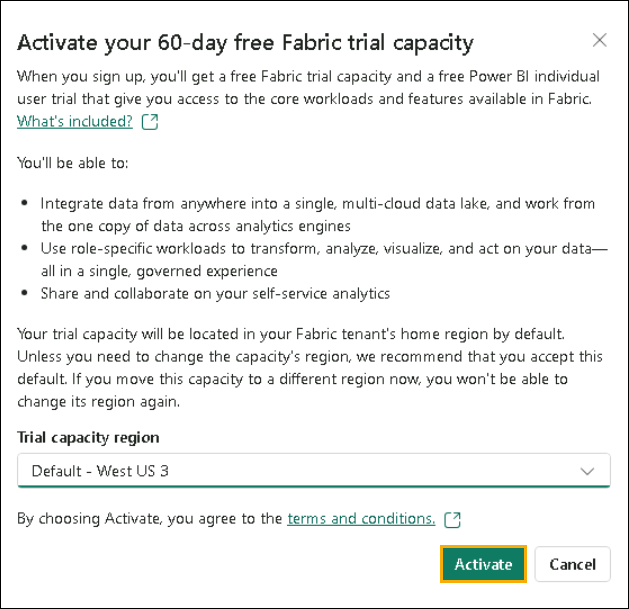
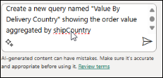
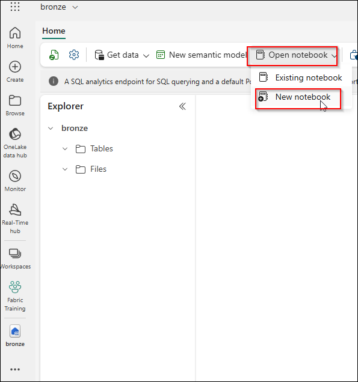
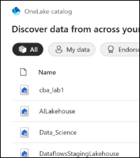

# Lab 1: Create and set up Fabric Workspace 

## Estimated Duration: minutes

## Lab Overview


## Lab objectives

In this lab, you will complete the following tasks:

- Task 1: Start Free fabric trial 

- Task 2: Create workspace and link with Fabric Copilot enabled capacity (F2) 

## Prerequisites

## Exercise 1: Start Free fabric trial

## Task 1: Enable a Microsoft Fabric trial license

1. On the lab VM desktop, open the **browser** and navigate to [Microsoft Power BI Portal](https://app.powerbi.com/). You will be navigated to the login page.

    >**Note:** If you're using the lab environment, it may sign you
    automatically.

    >**Note:** If you are not using the lab environment and have an existing
    Power BI account, you may want to use the browser in private / incognito
    mode.

2. Copy the Username and paste it into the Email field of the dialog and select Submit.

   - **Email/Username:** <inject key="AzureAdUserEmail"></inject>

        

3. On the **Sign into Microsoft Azure** tab, you will see the login screen. Enter the following **Email/Username** and then click on **Next**.

   - **Email/Username:** <inject key="AzureAdUserEmail"></inject>

        

4. Now enter the following **Password** and click on **Sign in.**

   - **Password:** <inject key="AzureAdUserPassword"></inject>

        

5. You will be navigated to the familiar **Power BI Service Home page**.

6. We assume you are familiar with the layout of Power BI Service. If you have any questions, please do not hesitate to ask the instructor.

    Currently, you are in the **My Workspace**. To work with Fabric items,
    you will need a trial license and a workspace that has Fabric license
    assigned. Let's set this up.

7. On the top right corner of the screen, select the **user** **icon**.

8. Select **Free trial**.

    

9. Upgrade to a free Microsoft Fabric trial dialog opens. Select **Activate**.

    

10. Successfully upgraded to Microsoft Fabric dialog opens. Select **Fabric Home Page**.

    

11. You will be navigated to the **Microsoft** **Fabric Home page**.

    

# Fabric Workspace

## Task 2: Create a Fabric Workspace

1. Now let's create a workspace with a Fabric license. Select **Workspaces** **(1)** from the left navigation bar. A dialog opens.

2. Click **+ New workspace** **(2)** found at the bottom of the pop-out menu.

    

3. **Create a workspace** dialog opens on the right side of the browser.

4. Type the name **Workspace<inject key="DeploymentID" enableCopy="false"/>**, **validate** the availability of the name, and click on **Advanced**.

    >**Note:** Only use the workspace name provided above.

    

5. Ensure **Fabric capacity** is enabled, verify that **capacity<inject key="DeploymentID" enableCopy="false"/> - <inject key="Region" enableCopy="false"/>** is selected under **Capacity**, and then click **Apply**.

    

    >**Note:** Close any pop-up that appears on the screen.

    

    >**Note:** Wait for the Power BI Workspace to load.

    A new workspace has been created, and you will be able to navigate into
    this workspace. We will bring data from the different data sources into
    a Lakehouse and use the data from the Lakehouse to build our model and
    report on it. The first step is to create a Lakehouse.

# Exercise 2: Explore Copilot for Data Flows

Microsoft has integrated Copilot and other generative AI features into
Fabric to introduce new ways for you to transform and analyze data,
generate insights, and create visualizations and reports. You must
enable Copilot before you can use it. Copilot in Fabric is not available
in all regions. In this activity, you will integrate Copilot for data
analysis and visualization.

1. Log into your Fabric workspace.

    >**Note**: If you don't have a workspace set up, go to the following link to access a functional work environment. You should have your Fabric account open. https://aka.ms/UnlockingDataMgmtAIWorkshop_Fabricworkspace

2. In the **Get data in your lakehouse** pane, select **New Dataflow Gen2**.

    

3. Select the **Dataflow Gen2** in the menu, then in the **Name** field, enter **North Wind Data**.

    

4. On the Power Query toolbar, on the **Home** tab select **Copilot**.

    

5. On the **Home** tab, select **New query** >> **Get data** >> **More** and then select **New source**.

    

6. In the **Choose data source** field, enter **OData** to filter the possible data sources, and then select **OData.**

    

7. In the **Connect to data source** window, under **Connection settings**, in the **URL** field, enter https://services.odata.org/V4/Northwind/Northwind.svc/ and then select **Next.**

    

8. In the **Choose Data** window, select the following seven tables **Customers**,**Employees**,**Order_Details**,**Orders**,**Products**,**Shippers**,**Suppliers**, and then select **Create.** 

    

9. Load the data to the Lakehouse by selecting **Publish**. Check that the Lakehouse selected is the one you created in the last activity.

10. The query should look like the following example:

    

## Task 2: Ingest the dataset via Data Pipelines to Lakehouse File Section

In this activity, you will ingest the dataset into the Lakehouse File section using Data Pipelines.

1. You will be navigated to your workspace. Select **North Wind Data** dataflow that you have created.

1. In the **Customers** table, scroll to the right and examine the **Country** column. Notice that the countries include **Argentina** and **Mexico**.

    

2. In the **Copilot** pane enter **Only keep South American customers** and then select **Send**.

    

    >**Note**: Due to the nature of Copilot you may end up with differing results. You can also try Only keep customers from South American countries

    The desired Applied Step text is :
    ```
    Table.SelectRows(#"Navigation 1", each List.Contains({"Mexico",
    "Brazil", "Argentina", "Chile", "Peru", "Colombia", "Venezuela", 
    "Ecuador", "Bolivia", "Paraguay", "Uruguay", "Guyana", 
    "Suriname"}, [Country]))
    ```
3. It selected Mexico only:

    

    You can undo the step by selecting **Undo**. Afterwards, type: Only keep South American customers. If this step returns Mexico only, then insert the following step in the **transformation** tab:

    ```
    Table.SelectRows(#"Navigation 1", each
    List.Contains({"Mexico", "Brazil", "Argentina", "Chile",
    "Peru", "Colombia", "Venezuela", "Ecuador", "Bolivia", 
    "Paraguay", "Uruguay", "Guyana", "Suriname"}, [Country]))
    ```
    

4. The **Country** column has been filtered and now only includes customers from South America.

    

5. In the **Copilot** pane, select **Undo** to revert the changes, as we want to use Copilot against the whole dataset.

6. In the **Copilot** pane, enter **How many customers in each country?** and then select **Send**.

    

    Sometimes, due to the nature of Copilot, you may end up with different results or errors. Select **Undo** in the Copilot chat.

    

    

    >**Note**: You need to have an accurate question, so you can also try:*

    What is the total number of customers in each country?

    The desired Applied Step text is :

    ```
    Table.Group(#"Navigation 1", {"Country"}, {{"Total Customers",
    each Table.RowCount(_)}})
    ```

7. The query outputs a list displaying the number of customers per country.

    

8. In the **Copilot** pane, select **Undo** to revert the changes.

    

9. Select the **Order_Details** query, then in the **Copilot** pane, enter **Only keep orders whose quantities are above the median value** and then select **Send**.

    

10. The **Quantity** column now displays all values above 20.

    

11. On the **Power Query** toolbar, on the **Home** tab, select **Advanced editor** under **Query** section.

12. Review the definition of the formula used in the query.

    

13. Select **Cancel** to exit the Advanced editor without making changes.

    

14. In the **Copilot** pane, select **Undo** to revert the changes.

    


15. In the **Copilot** pane, enter **Create a new query with data for official public holidays for Australia in 2024** and then select **Send**.

    

    

    Australian public holidays have been added to the list. Review them as needed.

16. In the **Copilot** pane, select **Undo** to revert the changes.

17. In the **Copilot** pane, enter the following text and then select **Send**: **Create a new query with average monthly temperatures for Spain between 2022 and 2025. Display the Months in columns.**

    

18. In the **Copilot** pane, select **Undo** to revert the changes.

    

19. Select the **Orders** query.

20. In the **Copilot** pane, enter the following text and then select **Send**: **Create a new query named "Value By Delivery Country" showing the order value aggregated by shipCountry.**

    

21. A table containing the shipCountry and order value aggregates is displayed.

    

22. On the **Power Query** toolbar, on the **Home** tab, select **Advanced editor** under **Query** section to verify the correct formula.
    

23. The value of Freight is being used. Should this be the intended behavior? Review Copilot's actions to confirm.

    

24. Select **Cancel** to close the Advanced editor, and then in the **Copilot** pane, select **Undo** to revert the changes.

25. Check the destination location of the dataset in the bottom right corner. 

    

    

    

26. Select **Publish** to publish your data to your lake house. Select your target Lakehouse connection before publishing. (Skip this step if you already published the dataset in an earlier step.)

## Exercise 2: Exploring Copilot capabilities in Fabric notebooks

In this activity, you will explore Copilot capabilities in Fabric
notebooks.

1. Open a new browser tab and go to
    [PowerBI](https://app.powerbi.com/)

2. Open the Fabric training Workspace you created previously.

3. In the lower left of the navigation pane for the workspace, select **Fabric**.

4. Select the bronze Lakehouse you created previously. 

5. On the menu for the Fabric workshop Lakehouse and then select **Open notebook** >> **New notebook**.

    

6. At the upper left of the page, select the notebook name. Replace the name with CopilotDemoNotebook and select **Enter**

    

7. On the menu for the notebook, select **Copilot**.

8. Select **Get Started**. Copilot adds a new cell to the notebook.

    

    

9. Select **Run cell** (the triangular Play button) to install the packages that Copilot needs.

    

    >**Note**: The following command may error out. Please copy and paste the entire code snippet to Copilot to get the correct code and replace it.

10. Move the cursor to the lower left of the last cell in the notebook and select **+ code** to add a new cell.

    

11. Enter the following code in the new cell and then select **Run cell**.

    >**Note**: This code specifies Azure storage access and connectivity information for the NYC Yellow Taxi open dataset. The last line of code filters the data to limit the volume of data that you'll ingest for this exercise.

    ```
    storage_account_name = "azureopendatastorage"
    container_name = "nyctlc"

    sas_token = r"" # Specify blank since container is public with anonymous access

    spark.conf.set("fs.azure.sas.%s.%s.blob.core.windows.net" % (container_name, storage_account_name),sas_token)

    directory = "yellow"
    year = 2016
    months = "1,2,3,4,5,6"
    wasbs_path = f"wasbs://{container_name}@{storage_account_name}.blob.core.windows.net/{directory}"
    nyc_yellowtaxi_df = spark.read.parquet(wasbs_path)

    filtered_nyc_yellowtaxi_df = nyc_yellowtaxi_df.filter(f"puYear = {year} AND puMonth IN ({months})")
    ```

    >**Warning**: As each cell runs, a message will indicate that Spark jobs are in progress. Once processing is complete, a message will confirm the success of the Spark jobs. If the code in a particular cell fails, processing for the other cells will not continue.*

12. Add another cell to the notebook. Add the following code to the new cell and then select the **Run cell** button. This code saves the data as a delta table in the Lakehouse.

    ```
    table_name = "nyc_yellowtaxi_raw"
    filtered_nyc_yellowtaxi_df.write.mode("overwrite").format("delta").saveAsTable(
    f"{table_nam e}")
    print(f"Spark dataframe (filtered_nyc_yellowtaxi_df) saved to a delta table:
    {table_name}")
    ```

    

13. Add another cell to the notebook. Add the following code to the new cell and then select the **Run cell** button. This code runs a query to select and aggregate data.

    ```
    %%sql
    select puYear, puMonth, count(*) from nyc_yellowtaxi_raw group by puYear,
    puMonth order by puYear, puMonth
    ```

    >**Note**: The output dataset from the query should contain 6 rows, with each row showing the year, month, and the number of records for that period.

    

14. Add another cell to the notebook. Add the following code to the new cell and then select the **Run cell** button. This code counts the number of records returned.

    ```
    filtered_nyc_yellowtaxi_df.count()
    ```
    

    During testing, 69,402,938 rows were returned.

15. At the bottom of the Copilot pane, enter the following prompt and then select **Enter**:

    Describe the structure of the filtered_nyc_yellowtaxi_df dataframe

    

    >**Warning**:: Copilot for Fabric notebooks is in preview. During lab testing, we experienced mixed results when we submitted this prompt. In some cases, Copilot responds with a Python command that you can enter in a cell to describe the dataframe structure. The command should resemble the following:

    ```
    filtered_nyc_yellowtaxi_df.describe().show()
    ```

    In other cases, Copilot responded with "I'm unable to provide a description without more context or the structure of the dataset" or "I must decline to assist with that request." These issues should be resolved as this Copilot evolves.

    

16. If Copilot does not create a command for you, add a new cell to the notebook. Add the following code to the new cell and then select the **Run cell** button:

    ```
    filtered_nyc_yellowtaxi_df.describe().show()
    ```
    

17. At the bottom of the **Copilot** pane, enter the following prompt and then select **Enter**. Copilot should respond with a command that you can run to create the dataframe.

    ```
    Create a dataframe by loading data from nyc_yellowtaxi_raw table and sampling it with 1 percentage, count the rows in the dataframe and show the amount.
    ```
    


18. Select **Insert code** to create a new cell in the Notebook. Run the cell:

    

19. If Copilot does not create the command for you, add a new cell to the notebook. Then, add the following code to the new cell and then select the **Run cell** button.

    ```
    %%code
    Create a dataframe by loading data from nyc_yellowtaxi_raw table and
    sampling it with 1 percentage, count the rows in the dataframe and show the 
    amount.
    ```
**Important:** If you want to learn more about Chat-Magics, go to [Overview of chat-magics in Microsoft Fabric
notebook](https://learn.microsoft.com/en-us/fabric/get-started/copilot-notebooks-chat-magics)

# Exercise 3: Visualizing and gaining Insights using Copilot for Power BI

Let's leverage Copilot for Power BI to create interactive reports using curated data stored in OneLake. This exercise will guide you through the end-to-end process: connecting to your dataset, using Copilot for Power BI to explore data, and generating insightful visualizations with
minimal manual effort.

**Power BI:** This integration incorporates generative AI to
automatically build reports based on topics you select or prompts you
create.

In this exercise, you'll explore the capabilities of Copilot in Data Factory. The Power BI Copilot will be covered in a later exercise within this lab.

**Prerequisite **

- Ensure that the Power BI Desktop application is installed on your local machine.

- Ensure Copilot for Power BI is enabled.

- You must have the necessary permission to read the curated dataset from OneLake.

- Copilot is turned on by default in Fabric and now generally available, however it is not supported in sovereign clouds due to GPU availability. 

## Exercise 1: Generate reports using Copilot for Power BI

In this activity, you will use Copilot in Power BI to generate reports and enhance your data analysis process.

### Task 1: Connect to a Fabric dataset and create visualizations using Copilot

1. Open the **Power BI** application and select **Blank Report** to create a new dashboard. 

    [Power BI menu](images1/media/image52.png)

2. Ensure the Copilot button is enabled.  

     

3. Select **Get Data** to connect to the dataset needed for your
 report.

4. Select **Microsoft Fabric** and then select **Lakehouses.**  

    

5. Select the Lakehouse created in the earlier activity and select **Connect to SQL endpoint** by selecting the arrow next to **Connect**.

    

    

6. A navigator window appears to select the targeted dataset. Select the following entities and then select **Load**:

    Customers, employees, orders, order_details, products, shippers 

    

7. Create a real-time connection to your Lakehouse by selecting
    **Direct Query:**

    

8. Once connected, let\'s use Copilot to summarize our data. Select the **Prompt Guide**, then select **"Give me an executive summary."**

9. Next, select **"Suggest content for a new report page"** based on the semantic model.

10. Select **Order Analysis** to generate a report analyzing order quantities, unit prices, and discounts.

### Task 2:  Create DAX queries and update measures descriptions using Copilot

Let's use Dax query copilot to generate a new measure for **total Sales after Discount (measure)** and update the description of the current measure.

1. Select on **Dax query view**, then **Copilot (Preview).**  


    

     

    
 

    Ensure that the 'Measure Descriptions with Copilot' feature is enabled. Navigate to **File \Options \Preview** **Features**, then enable Measure Descriptions with Copilot at the bottom of the list.

    

    

1. Navigate to the **Model** and select the **new measure** created. 

2. Navigate to the **Properties** section for the model and select **Create with Copilot (preview).** Copilot generates a new measure description in a few seconds.

    

3. Review the measure description to ensure that it aligns with your model. Select **Keep it** to save the description.

    

    Now, let's publish the report to the Power BI service so that consumers can visualize and derive insights from it.

4. Select **File** and then select **Publish.** 

    

5. Select **Save** and then save the report as **Northwind Order Analysis** under your desired location on your machine.

6. Publish it under **'My Workspace'** or the workspace created during Activity 7.

### Task 3: Explore Copilot for PowerBI as a report consumer(optional)

 

1. Open your published report by selecting [Microsoft Fabric](https://app.fabric.microsoft.com/). Navigate to your workspace and then select the **Northwind Order Analysis.**

    

    

2. Select the **Copilot** logo on the top-right and open the prompt guide. 

    

3. Select **Summarize visual on the page** to gain insights from each visual.

4. Select "**Answer questions for leadership**" to prepare for your upcoming meeting with leadership.

5. Select **Edit.**

    

6. Ask Copilot to generate a report to monitor the current inventory by submitting the following prompt:
*Create a report monitoring the product inventory.*

    

7. Save the report so any other report consumer has access to it. 
