# Fabric Copilot Hands-On Lab

## Lab Overview

This hands on lab provides comprehensive training on leveraging Microsoft Fabric and Copilot capabilities for data ingestion, preparation, and visualization. Participants will create and set up a Fabric workspace using the pre-deployed Fabric capacity. They will ingest datasets into the Lakehouse via Data Pipelines, explore Copilot’s AI-assisted features in Fabric notebooks, and connect to Fabric datasets to generate visualizations in Power BI using Copilot. Additionally, participants will use Copilot to write DAX queries, update measure descriptions, and optionally explore Copilot as a report consumer, gaining a solid understanding of its potential across the data and analytics workflows in Microsoft Fabric.

## Lab objectives

In this lab, you will complete the following exercises:

- Exercise 1: Getting Started with Microsoft Fabric: Set Up a Workspace

- Exercise 2: Explore Copilot for Data Flows

- Exercise 3: Visualizing and gaining Insights using Copilot for Power BI

## Exercise 1: Getting Started with Microsoft Fabric: Set Up a Workspace

In this exercise, you will create a new workspace using the pre-deployed Fabric capacity. The workspace will be linked to a Copilot-enabled capacity, allowing you to prepare the environment for bringing in data, building models, and generating reports using Microsoft Fabric’s integrated tools.

### Task 1: Start Free fabric trial

In this task, you will activate the free 60-day Microsoft Fabric trial. This trial provides access to Fabric’s powerful data analytics, integration, and visualization features, enabling you to explore and work with the platform without requiring an active license.

1. On the top right corner of the screen, select the **User icon (1)** and select **Free trial (2)**.

    

1. When **Activate your 60-day free Fabric trial capacity** dialog opens. Select **Activate**.

    

    > **Note:** The trial capacity region may differ from the one shown in the screenshot. No need to worry – simply use the default selected region, activate it, and continue to the next step.

1. On **Successfully upgraded to Microsoft Fabric** dialog. Select **Got it**.

    

1. You will be navigated to the **Microsoft Fabric Home page**.

    

### Task 2: Create a workspace and link with Fabric Copilot-enabled capacity

In this task, you will create a new workspace in Microsoft Fabric to organize and manage your data and analytics assets. The workspace will be linked to a Copilot-enabled capacity, providing access to AI-powered features such as natural language queries and intelligent data insights.

1. Now let's create a workspace with a Fabric license. Select **Workspaces** **(1)** from the left navigation bar.

1. Click **+ New workspace (2)** found at the bottom of the pop-out menu.

    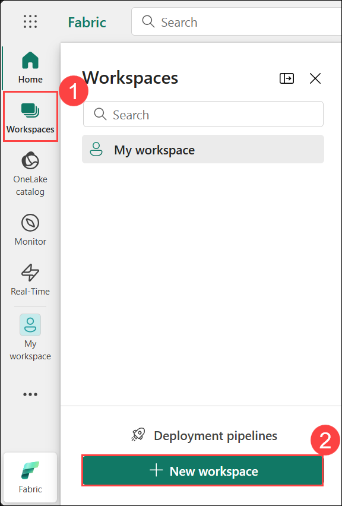

1. The **Create a workspace** dialog opens on the right side of the browser.

1. Enter the name **Workspace<inject key="DeploymentID" enableCopy="false"/> (1)**, validate that the name is available, and then click **Advanced (2)**.

    >**Note:** Please use the workspace name provided above.

    

1. Ensure **Fabric capacity (1)** is chosen, verify that **capacity<inject key="DeploymentID" enableCopy="false"/> - <inject key="Region" enableCopy="false"/> (2)** is selected under **Capacity**, and then click **Apply (3)**.

    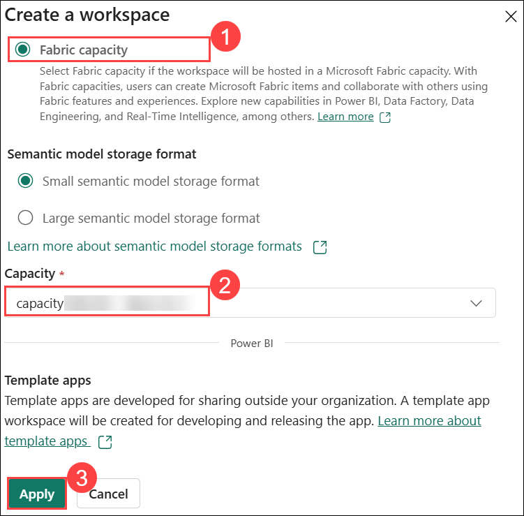

    >**Note:** Close any pop-up that appears on the screen.

    

    >**Note:** Wait for the Power BI Workspace to load.

1. A new workspace has been created, and you will be able to navigate into this workspace. We will bring data from the different data sources into a Lakehouse and use the data from the Lakehouse to build our model and report on it.

> **Congratulations** on completing the task! Now, it's time to validate it. Here are the steps:
> - Hit the Validate button for the corresponding task. If you receive a success message, you can proceed to the next task. 
> - If not, carefully read the error message and retry the step, following the instructions in the lab guide.
> - If you need any assistance, please contact us at cloudlabs-support@spektrasystems.com. We are available 24/7 to help you out.
<validation step="bf14a857-da8b-49dc-9159-77cb14984ba3" />

## Exercise 2: Explore Copilot for Data Flows

In this exercise, you will use Microsoft Fabric Copilot to ingest, transform, and analyze data. You will load the Northwind dataset using Dataflow Gen2, then use Copilot in Power Query and notebooks to generate queries, summarize data, and create Python code, showcasing AI-assisted data analysis.

Microsoft has integrated Copilot and other generative AI features into Fabric to introduce new ways for you to transform and analyze data, generate insights and create visualizations and reports. You must
enable Copilot before you can use it. Copilot in Fabric is not available in all regions. In this activity, you will integrate Copilot for data analysis and visualization.

### Task 1: Ingest the dataset via Data Pipelines to Lakehouse File Section

In this task, you will ingest the dataset into the **Lakehouse File** section using Data Pipelines.

1. Ensure you're logged into your Fabric workspace before proceeding.

1. Click on **+ New item (1)** button. In the pop-up window, search for **Lakehouse (2)** in the search bar and click on **Lakehouse (3)**.

    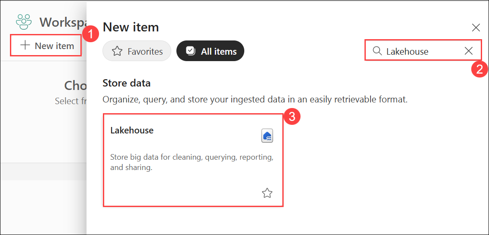

1. Enter the name **lakehouse<inject key="DeploymentID" enableCopy="false"/> (1)**, select the **Lakehouse schemas (Public Preview) (2)** checkbox, and then click **Create (3)**.

    .png)

1. You will be navigated to the newly created **Lakehouse**.

    >**Note:** If you see any pop-up tab like below you can close it for now.

    

1. From the **Lakehouse (1)** page, select **Get data (2)** from the toolbar, and then choose **New Dataflow Gen2 (2)**.

    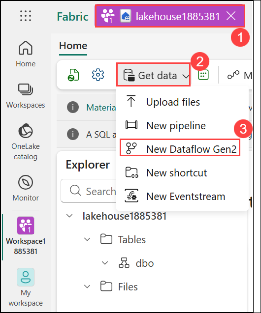
    
1. In the **Name** field enter **North Wind Data (1)** and click on **Create (2)**.

    

    > **Note:** The checkbox for **Enable Git Integration, deployment pipelines and Public API scenarios** is enabled by default ensure to keep it as it is.

1. On the **North Wind Data** page, go to the **Home** tab, and then select **Get data (1)** > **More (2)**.

    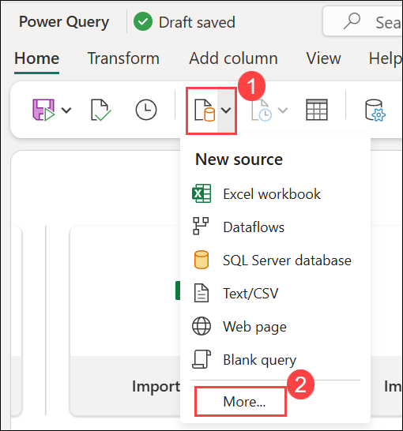

    >**Note:** If you don't see the **Get Data** option, it might be because your browser is zoomed in you can either zoom out the browser or in that case, then select **Get Data (1) > More (2).**

1. In the **Choose data source** field, type **OData (1)** to filter the available data sources, and then select **OData (2)**.

    

1. In the **Connect to data source** window, under **Connection settings**, paste **https://services.odata.org/V4/Northwind/Northwind.svc/** **(1)** into the **URL** field, and then select **Next (2)**.

    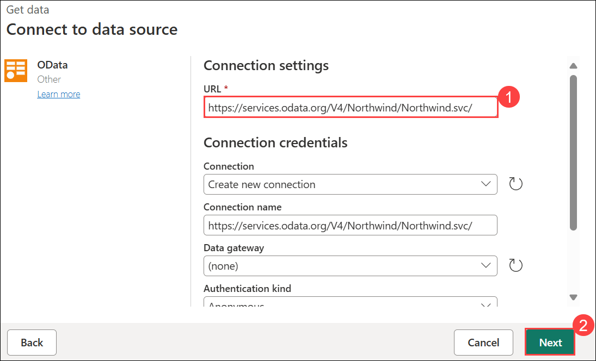
   
1. In the **Choose data** window, select the following seven tables **Customers**, **Employees**, **Order_Details**, **Orders**, **Products**, **Shippers**, **Suppliers**, and then select **Create.** 

    

1. Ensure that **Lakehouse (1)** is selected as the **Data destination**. Hover over the **(i)** icon to view lakehouse details. To load the data, click the **Down arrow (2)** beside the **Save & run** button in the top-left corner, and then select **Save & run (3)** from the drop-down.

    

1. The query should look like the following:

    

1. Navigate back to your workspace. Select **North Wind Data** dataflow that you have created.

    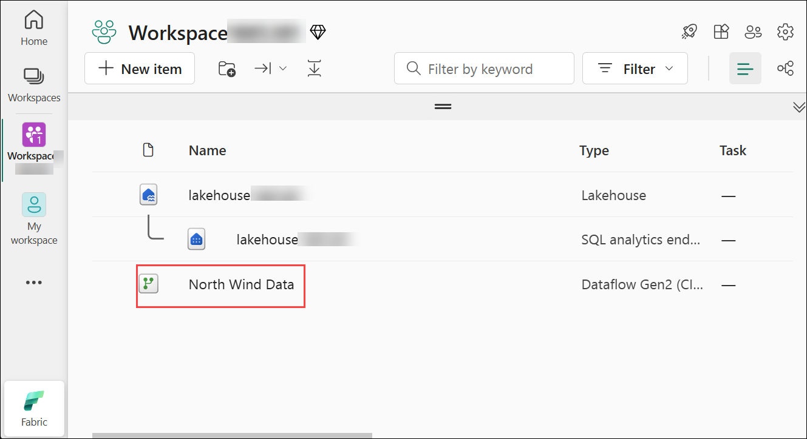

    > **Note:** Please wait a few minutes until **North Wind Data** **Dataflow Gen2** becomes clickable.

1. Select the **Customers(1)** table, **scroll to the right(2)** and examine the **Country(3)** column. Notice that the countries include **Argentina** and **Mexico**.

    .png)

1. On the **Power Query** toolbar, go to the **Home** tab, click the **>** option, and then select **Copilot** (if you don't see the Copilot option visible to you in the toolbar).

    

    

    > **Note:** If the **Copilot** option isn’t visible, try reducing your browser's zoom level.

    

1. In the **Copilot** pane enter **Only show Countries Brazil and Venezuela (1)** and then select **Send (2)**.

    

    >**Note:** Due to the nature of Copilot, you may end up with differing results.

    The desired Applied Step text is :
    ```
    Table.SelectRows(#"Navigation 1", each [Country] = "Brazil" or [Country] = "Venezuela")
    ```

1. You will now see that the table has been updated to display only **Brazil and Venezuela**. The Country column has been filtered to include only customers from Brazil and Venezuela.

    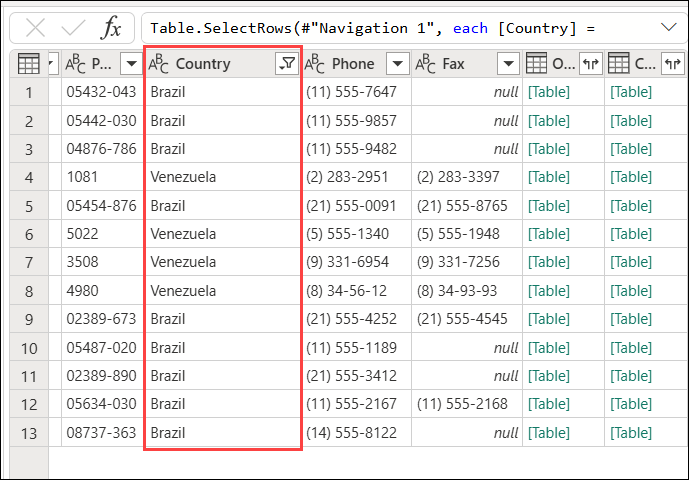

1. You can undo the step by selecting **Undo (2)** to revert the changes, as we want to use Copilot against the whole dataset. If the **Undo** option isn't visible, you can remove the filter by clicking the **x (3)** next to **Filter Rows**.

    

1. In the **Copilot** pane, enter **How many customers in each country?** and then select **Send**.

    

1. You will see the total customers present in each country. Sometimes, due to the nature of Copilot, you may end up with different results or errors.

    

    >**Note:** You need to have an accurate question, so you can also try: **What is the total number of customers in each country?**

    The desired Applied Step text is :

    ```
    Table.Group(#"Navigation 1", {"Country"}, {{"CustomerCount", each Table.RowCount(_)}})
    ```

1. The query outputs a list displaying the number of customers per country.

    

1. You can undo the step by selecting **Undo (1)** to revert the changes, as we want to use Copilot against the whole dataset. If the **Undo** option isn't visible, you can remove the filter by clicking the **x (2)** next to **Group by**.

    

1. Select the **Order_Details** query from the left pane, then in the **Copilot** pane, enter **Only keep orders whose quantities are above the median value** and then select **Send**.

    

    

1. The **Quantity** column now displays all values above 20.

    

1. On the **Power Query** toolbar, on the **Home** tab, select **Advanced editor**.

    

1. Review the definition of the formula used in the query.

1. Select **Cancel** to exit the Advanced editor without making changes.

    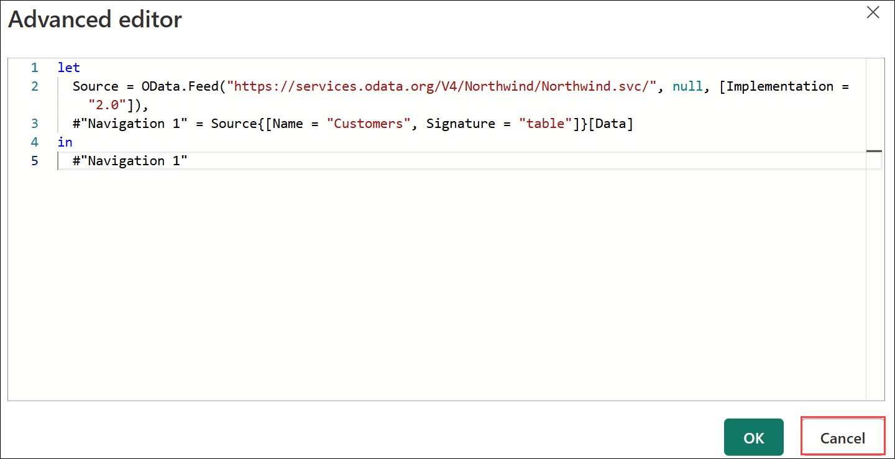

    >**Note:** In the Advance editor, the query values might be different from the screenshot mentioned.

1. In the **Copilot** pane, select **Undo** to revert the changes.

    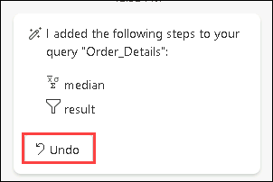
   
1. In the **Copilot** pane, enter **Create a new query with data for official public holidays for Australia in 2024** and then select **Send**.

    

    

1. Australian public holidays have been added to the list. Review them as needed.

1. In the **Copilot** pane, select **Undo** to revert the changes.

    

1. In the **Copilot** pane, enter the following text: **Create a new query with average monthly temperatures for Spain between 2022 and 2025. Display the Months in columns** and then select **Send**

    

    

1. In the **Copilot** pane, select **Undo** to revert the changes.

    

1. Select the **Orders** query.

    

1. In the **Copilot** pane, enter the following text: **Create a new query named "Value By Delivery Country" showing the order value aggregated by shipCountry** and then select **Send**

    

1. A table containing the **shipCountry** and **Order value aggregates** is displayed.

    

1. On the **Power Query** toolbar, on the **Home** tab, select **Advanced editor** to verify the correct formula.

    

1. The value of Freight is being used. Should this be the intended behavior? Review Copilot's actions to confirm.

    

1. Select **Cancel** to close the **Advanced editor**, and then in the **Copilot** pane, select **Undo** to revert the changes.

    

    

1. Select **Customer** query then ensure that **Lakehouse** is selected as the **Data destination.**

    

1. Click the **Down arrow** next to the **Save and Run (1)** icon, and then select **Save and Run (2)** to save your data to your Lakehouse. Make sure to select your target Lakehouse connection before saving. (Skip this step if you have already saved the dataset in an earlier step.)

     

> **Congratulations** on completing the task! Now, it's time to validate it. Here are the steps:
> - Hit the Validate button for the corresponding task. If you receive a success message, you can proceed to the next task. 
> - If not, carefully read the error message and retry the step, following the instructions in the lab guide.
> - If you need any assistance, please contact us at cloudlabs-support@spektrasystems.com. We are available 24/7 to help you out.
<validation step="a2c099c2-1da1-4240-8b09-280d6f094dba" />

### Task 2: Exploring Copilot capabilities in Fabric notebooks

In this task, you will explore Copilot capabilities in Fabric notebooks.

1. In the **Workspace<inject key="DeploymentID" enableCopy="false"/>** Fabric workspace you created earlier, select the **lakehouse<inject key="DeploymentID" enableCopy="false"/>** you previously created.
  
    

    >**Note:** Wait for the tables to load up before proceeding to the next steps.

1. On the **Fabric workshop Lakehouse**, use the menu bar to select **Open notebook (1)**, and then choose **New notebook (2)**.

    

    >**Note:** If the tour pop-up appears, you can skip it for now by selecting **Skip tour**.

    

1. At the upper left of the page, select the notebook name **Notebook 1 (1)**. Replace it with **CopilotDemoNotebook (2)**, and press **Enter** on your **keyboard**.

    

1. From the notebook menu, click the **ellipsis (...) (1)**, and then select **Copilot (2)**.

    

    >**Note:** If the tour pop-up appears, feel free to skip it for now.

1. Click **Get Started (1)** in the Copilot tab, then select **Run cell (2)** button to initiate the session. Once the session has started, you can proceed to the next step.

    .png)

    >**Note:** As this is your first session, it may take a few minutes (around 1-2 minutes) to get started.

1. Move the cursor to the lower left of the last cell in the notebook, and select **+ Code** to add a new cell.

    >**Note:** If you don’t see the + Code button, hover slightly below the last cell to reveal it.

    

1. Enter the following **code (1)** in the new cell and then select **Run cell (2)**.

    >**Note:** This code specifies Azure storage access and connectivity information for the NYC Yellow Taxi open dataset. The last line of code filters the data to limit the volume of data that you'll ingest for this exercise.

    >**Note:** Running the code may take 2–3 minutes. Please wait for it to complete.

    ```
    storage_account_name = "azureopendatastorage"
    container_name = "nyctlc"

    sas_token = r"" # Specify blank since container is public with anonymous access

    spark.conf.set("fs.azure.sas.%s.%s.blob.core.windows.net" % (container_name, storage_account_name),sas_token)

    directory = "yellow"
    year = 2016
    months = "1,2,3,4,5,6"
    wasbs_path = f"wasbs://{container_name}@{storage_account_name}.blob.core.windows.net/{directory}"
    nyc_yellowtaxi_df = spark.read.parquet(wasbs_path)

    filtered_nyc_yellowtaxi_df = nyc_yellowtaxi_df.filter(f"puYear = {year} AND puMonth IN ({months})")
    ```

    >**Warning:** As each cell runs, a message will indicate that Spark jobs are in progress. Once processing is complete, a message will confirm the success of the Spark jobs. If the code in a particular cell fails, processing for the other cells will not continue.

    

    > **Note:** To view the Spark jobs, expand the **Spark jobs** section as shown in the snapshot below.

    .png)

    .png)

1. Add another cell to the notebook. Add the following code to the new cell and then select the **Run cell** button. This code saves the data as a delta table in the Lakehouse.

    ```
    table_name = "nyc_yellowtaxi_raw"

    filtered_nyc_yellowtaxi_df.write.mode("overwrite").format("delta").saveAsTable(f"{table_name}")
    print(f"Spark dataframe (filtered_nyc_yellowtaxi_df) saved to a delta table: {table_name}")
    ```

    

    >**Note:** It may take around 1-2 minutes to run the above notebook code.

1. Add another cell to the notebook. Add the following code to the new cell and then select the **Run cell** button. This code runs a query to select and aggregate data.

    ```
    %%sql
    select puYear, puMonth, count(*) from nyc_yellowtaxi_raw group by puYear, puMonth order by puYear, puMonth
    ```

    >**Note:** The output dataset from the query should contain 6 rows, with each row showing the year, month, and the number of records for that period.

    

1. Add another cell to the notebook. Add the following code to the new cell and then select the **Run cell** button. This code counts the number of records returned.

     ```
     filtered_nyc_yellowtaxi_df.count()
     ```

    

    >**Note:** During testing, 69,402,938 rows were returned.

1. At the bottom of the Copilot pane, enter the prompt **Describe the structure of the filtered_nyc_yellowtaxi_df dataframe** and then select **Enter**.

    

    

    >**Note:** The output may differ from what is shown in the screenshot.

    >**Warning:** Copilot for Fabric notebooks is in preview. During lab testing, we experienced mixed results when we submitted this prompt. In some cases, Copilot responds with a Python command that you can enter in a cell to describe the dataframe structure. The command should resemble the following:

    ```
    filtered_nyc_yellowtaxi_df.describe().show()
    ```

1. In other cases, Copilot responded with **I'm unable to provide a description without more context or the structure of the dataset** or **I must decline to assist with that request**. These issues should be resolved as this Copilot evolves.

1. If Copilot does not create a command for you, add a new cell to the notebook. Add the following code to the new cell and then select the **Run cell** button:

    ```
    filtered_nyc_yellowtaxi_df.describe().show()
    ```

    

    

    > **Note:** Running the code may take 2–3 minutes. Please wait for it to complete.

1. At the bottom of the **Copilot** pane, enter the following prompt and then select **Enter**. Copilot should respond with a command that you can run to create the dataframe.

    ```
    Create a dataframe by loading data from nyc_yellowtaxi_raw table and sampling it with 1 percentage, count the rows in the dataframe and show the amount.
    ```

1. Select **Insert code(1)** to create a new cell in the Notebook. Run the cell:

    

    

    > **Note**: If you do not see the **Insert Code** option copy the code generated by Copilot, add a new cell in the notebook and paste it, then click on **Run Cell**

1. If Copilot does not create the command for you, add a new cell to the notebook. Then, add the following code to the new cell and then select the **Run cell** button.

    ```
    %%code
    Create a dataframe by loading data from nyc_yellowtaxi_raw table and sampling it with 1 percentage, count the rows in the dataframe and show the amount.
    ```

    

1. If you encounter any issues creating the command with Copilot or see errors in the results, you can use the code below, which was generated by Copilot while testing the functionality. Add the following code to the new cell and then select the **Run cell** button.

    ```
    # ATTENTION: AI-generated code can include errors or operations you didn't intend. Review the code in this cell carefully before running it.

    # Load the table into a DataFrame
    nyc_yellowtaxi_raw_df = spark.read.table("nyc_yellowtaxi_raw")

    # Sample 1% of the data
    sampled_df = nyc_yellowtaxi_raw_df.sample(0.01)

    # Count the rows in the sampled dataframe
    row_count = sampled_df.count()

    # Show the row count
    print(f"Number of rows in the sampled dataframe: {row_count}")
    ```

    

    **Important:** If you want to learn more about Chat-Magics, go to [Overview of chat-magics in Microsoft Fabric notebook](https://learn.microsoft.com/en-us/fabric/get-started/copilot-notebooks-chat-magics)

# Exercise 3: Visualizing and gaining Insights using Copilot for Power BI

In this exercise, you will use Copilot for Power BI to connect to a Microsoft Fabric dataset, generate visual reports, create and describe DAX measures, and gain insights using natural language prompts. You’ll build a report from a Lakehouse, use Copilot to summarize data, generate report content, suggest measures, and publish the report to the Power BI service. Finally, you will explore the report as a consumer, using Copilot to summarize visuals and answer leadership questions.

Let's leverage Copilot for Power BI to create interactive reports using curated data stored in OneLake. This exercise will guide you through the end-to-end process: connecting to your dataset, using Copilot for Power BI to explore data, and generating insightful visualizations with minimal manual effort.

**Power BI:** This integration incorporates generative AI to automatically build reports based on topics you select or prompts you create.

### Task 1: Connect to a Fabric dataset and create visualizations using Copilot

In this task, you will connect to a Fabric dataset to access and explore structured data. Using Microsoft Fabric Copilot, you will generate visualizations by simply describing the insights you need. This enables quick, AI-assisted data analysis and streamlined report creation.

1. Launch the **Power BI** application by double clicking the desktop shortcut icon.

    

1. Click on **Sign in (1)** from the upper right corner of the application. Provide Email: **<inject key="AzureAdUserEmail" enableCopy="true"/> (2)** then click **Continue (3)**.

    

1. On the **Sign in to Microsoft** tab, you will see a login screen. Enter the following email and then click on **Next**.

    - Email: **<inject key="AzureAdUserEmail" enableCopy="true"/>** 
   
      
     
1. Now enter the following password and click on **Sign in**.

    - Enter password: **<inject key="AzureAdUserPassword" enableCopy="true"/>**
   
       

1. On the **Automatically sign in to all desktop apps and websites on this device** pop-up, click on **No, this app only**.

    

1. Select **Blank Report** to create a new dashboard. 

     

    >**Note:** If you receive any pop-ups, please **Close** them.

    

    

1. Select **Get Data** **-> (1)** **More...(2)** to connect to the dataset needed for your report.

     

1. Select **Microsoft Fabric (1)** and then select **Lakehouses (2) -> Connect (3)**

    

1. Select the **lakehouse<inject key="DeploymentID" enableCopy="false"/> (1)** created in the earlier exercise and select **Connect to SQL endpoint (3)** by selecting the arrow next to **Connect (2)**.

    

1. Then, log in using the credentials provided below.

    - Email: **<inject key="AzureAdUserEmail" enableCopy="true"/>**

    - Enter password: **<inject key="AzureAdUserPassword" enableCopy="true"/>**

1. A navigator window appears to select the targeted dataset. Select the following entities and then select **Load:**

    **Customers, Employees, Orders, Order_Details, Products, Shippers, Suppliers**

    

1. Create a real-time connection to your Lakehouse by selecting **DirectQuery (1)** then **OK (2)**.

    

1. On the Home menu, click on **Copilot**.

    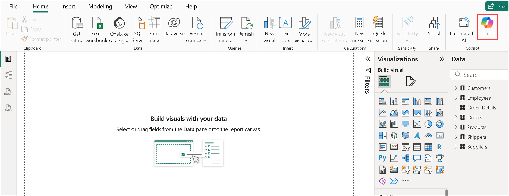

    >**Note:** If you're unable to find Copilot, try zooming out the browser tab to 80% - it should then become visible.

1. Select the workspace **Workspace<inject key="DeploymentID" enableCopy="false"/> (1)** and click **OK (2)**.

    

1. Click **Get started** in the Copilot chat window.

    

1. Once connected, let's use Copilot to summarize our data. Select the **Prompt Guide (1)**, then select **"Give me an executive summary" (2)**

    

    

    >**Note**: If you don’t get a result the first time, repeat the step by selecting **Prompt Guide (1)**, then **"Give me an executive summary" (2)** to generate the result.

1. Select the **Prompt Guide (1)**, then select **"Suggest content for a new report page" (2)** based on the semantic model.

    
   
1. Select **+ Create (1)** under **Sales Performance** to generate a report analyzing order details, unit prices, and quantities sold.

    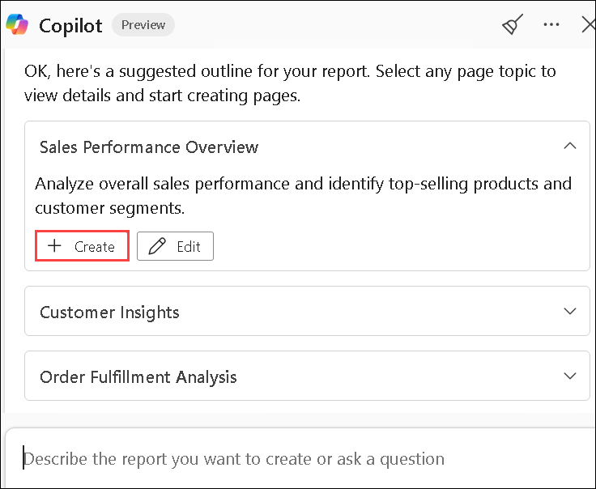

    > **Note:** Copilot’s suggestions may vary. Please proceed by creating whatever Copilot suggests, even if it differs from the example shown.

1. To view the chart clearly after generating the report, minimize the **Filters (1)**, **Visualizations (2)**, and **Data (3)** panes, and close the **Copilot Suggestions (4)** tab. 

    

    

    > **Note:** Copilot’s suggestions may vary. Please proceed by creating whatever Copilot suggests, even if it differs from the example shown.

### Task 2: Create DAX queries and update measure descriptions using Copilot

In this task, you will use DAX Query Copilot to extend your dataset with new calculations and improve documentation. Copilot will help you generate a new measure for **Total Sales after Discount** and update the description of an existing measure to ensure clarity and consistency.

1. On **Power BI** from the left pane, select the **Dax query view (1)**, then **Copilot (2).**

    

    >**Note:** Close any pop-up that appears on the screen.

    
    
1. Under **Dax query view (1)**, select **Copilot (Preview) (2)** then select **Suggest measures** option.

    

    >**Note:** If you get pop up something went wrong, close it and continue from step 3.

1. Once the measure has been generated, verify it and click **Discard query** for now as it would create different code for every users.

     

     >**Note:** When the **Exit Copilot?** window pops up, click **Yes** to exit.

     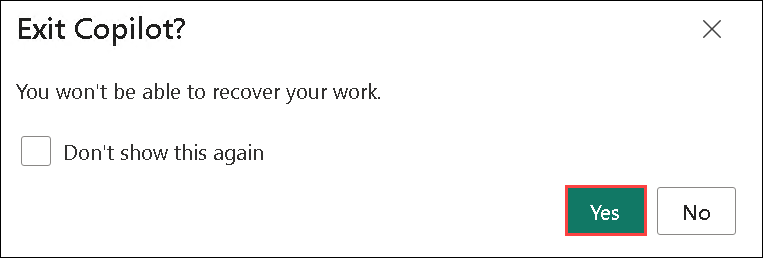

1. To proceed, copy the code provided below and paste it into the **query box (1)**. 

    ```
    // DAX query generated by Fabric Copilot with "Based on my data suggest new measures in a DAX query for further analysis and try them out with one or more suitable columns"
    DEFINE
    // New measure: Total Sales computed from Order_Details
    MEASURE 'Order_Details'[Total Sales] =
        SUMX(
        'Order_Details',
        'Order_Details'[UnitPrice] * 'Order_Details'[Quantity] * (1 - 'Order_Details'[Discount])
        )
    
    // New measure: Average Order Value computed at the Order level
    // Assumes each order aggregates its Order_Details' Total Sales.
    MEASURE 'Orders'[Average Order Value] =
        DIVIDE(
        CALCULATE([Total Sales]),
        COUNTROWS('Orders')
        )

    EVALUATE
    // Summarize by Customer to try out the new measures with a suitable column 
    // (here Customers[CompanyName] is used to identify each customer).
    SUMMARIZECOLUMNS(
        Customers[CustomerID],
        Customers[CompanyName],
        "Customer Total Sales", CALCULATE([Total Sales]),
        "Customer Average Order Value", CALCULATE([Average Order Value])
    )
    ORDER BY Customers[CompanyName] ASC
    ```

1. Now, you can **Run (2)** the query to see the results of the query generated. Then, **select anywhere (3)** on the query tab to make the **Update model with changes** button enables and then click **Update model with changes (4)** to generate measures in **Model**.

    

1. Then, on the **Are you sure?** tab, select **Update model**.

    

    >**Note:** You may need to wait for 1-2 minutes for **Update model with changes** option to be enabled after running the query.

    >**Note:** Since these are **Copilot** suggested measures, they might differ from the screenshots shown in the guide.

1. In the **Data** window, select the **Model (1)** tab and notice the two measures created. Expand **Measures (2)** and review the **list of measures (3)**.

    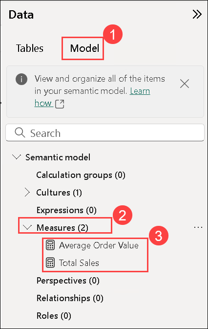
   
    > **Note:** Copilot’s suggestions may vary. Please proceed by creating whatever Copilot suggests, even if it differs from the example shown.

1. Navigate to the **Model view (1)** on the left pane and select the New measure **Average order value (2)** created. Navigate to the **Properties** section for the model and select **Create with Copilot (preview) (3).** Copilot generates a new measure description in a few seconds.

    

1. Review the measure **Description** to ensure that it aligns with your model. Select **Keep it** to save the description.

    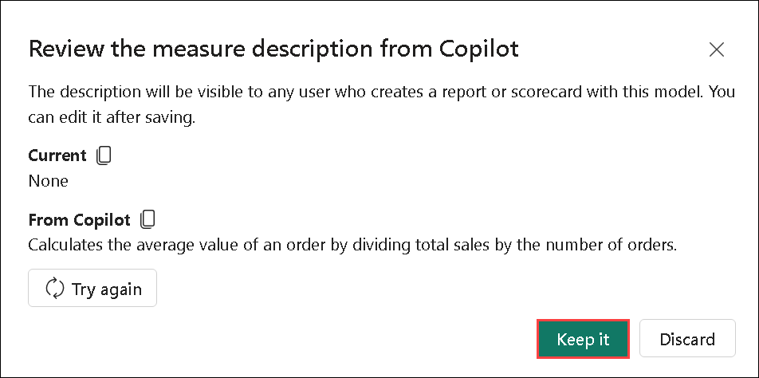

1. You will observe that the **Description** has been automatically added by Copilot.

    

1. Now, let's publish the report to the Power BI service so that consumers can visualize and derive insights from it.

1. Select **Home (1)** and then select **Publish (2).** 

    

1. Select **Save**.

    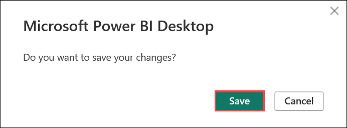

1. Save the report as **Northwind Order Analysis (1)** then click on **Save (2)**.   

    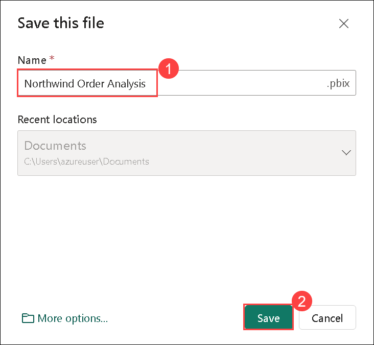

1. Select **Workspace<inject key="DeploymentID" enableCopy="false"/> (1)** and click **Select (2)** to publish it under the workspace.

    

1. After the report gets published, you will see the Success pop-up window.

    

### Task 3: Explore Copilot for Power BI as a report consumer

In this task, you will explore Copilot for Power BI from a report consumer’s perspective. Copilot allows you to ask natural language questions directly within a report and receive instant insights. This helps you quickly understand data trends, summaries, and key metrics without the need to write complex queries.

1. Open a new tab in **Microsoft Edge**, and navigate to **Microsoft Fabric** by pasting the following **URL** into the address bar (if it is not already open).

    ```
    https://app.fabric.microsoft.com/
    ```

1. Navigate to your workspace and then select the **Northwind Order Analysis** report. You will see the visual report displayed on the screen :

    

    

1. Select the **Copilot** logo on the top-right and click on **Get started** to open the prompt guide. 

    

    

1. Select **Prompt guide (1)** then click **Summarize visual on the page (2)** to gain insights from each visual. The output you observe should resemble the example below:

    

    ```
    The "Sales Performance" page of the Northwind Order Analysis report contains three visuals:

    1. **Total Sales:**

        - The total sales amount is $56.5K.

    2. **Sales by Region:**

        - Sales are uniformly distributed across all regions listed, each with a sales amount of $56.5K.
        - Regions include AK, BC, CA, Co. Cork, DF, ID, Isle of Wight, Lara, MT, NM, Nueva Esparta, OR, Québec, RJ, SP, Táchira, WA, and WY.

    3. **Sales by Product:**
        - Sales are uniformly distributed across all products listed, each with a sales amount of $56.5K.

        - Products include Alice Mutton, Aniseed Syrup, Boston Crab Meat, Camembert Pierrot, Carnarvon Tigers, Chai, Chang, Chartreuse verte, Chef Anton's Cajun Seasoning, Chef Anton's Gumbo Mix, Chocolade, Côte de Blaye, Escargots de Bourgogne, Filo Mix, Flotemysost, Geitost, Genen Shouyu, Gnocchi di nonna Alice, Gorgonzola Telino, Grandma's Boysenberry Spread, Gravad lax, Guaraná Fantástica, Gudbrandsdalsost, Gula Malacca, Gumbär Gummibärchen, Gustaf's Knäckebröd, Ikura, Inlagd Sill, Ipoh Coffee, Jack's New England Clam Chowder, Konbu, Lakkalikööri, Laughing Lumberjack Lager, Longlife Tofu, Louisiana Fiery Hot Pepper Sauce, Louisiana Hot Spiced Okra, Manjimup Dried Apples, Mascarpone Fabioli, Maxilaku, Mishi Kobe Niku, Mozzarella di Giovanni, Nord-Ost Matjeshering, Northwoods Cranberry Sauce, NuNuCa Nuß-Nougat-Creme, Original Frankfurter grüne Soße, Outback Lager, Pâté chinois, Pavlova, Perth Pasties, Queso Cabrales, Queso Manchego La Pastora, Raclette Courdavault, Ravioli Angelo, Rhönbräu Klosterbier, Röd Kaviar, Rogede sild, Rössle Sauerkraut, Sasquatch Ale, Schoggi Schokolade, Scottish Longbreads, Singaporean Hokkien Fried Mee, Sir Rodney's Marmalade, Sir Rodney's Scones, Sirop d'érable, Spegesild, Steeleye Stout, Tarte au sucre, Teatime Chocolate Biscuits, Thüringer Rostbratwurst, Tofu, Tourtière, Tunnbröd, Uncle Bob's Organic Dried Pears, Valkoinen suklaa, Vegie-spread, Wimmers gute Semmelknödel, and Zaanse koeken.
    ```

1. Again, select **Prompt guide (1)** then click **Answer questions from leadership (2)** to prepare for your upcoming meeting with leadership. The output you observe should resemble the example below.

    

    ```
    The Northwind Order Analysis report provides an overview of sales performance across different products and regions. The total sales amount to 56.5K. Sales by region indicate that each region, including AK, BC, CA, Co. Cork, DF, ID, Isle of Wight, Lara, MT, NM, Nueva Esparta, OR, Québec, RJ, SP, Táchira, WA, and WY, has a uniform sales value of 56.5K.

    Sales by product show a wide range of sales values. Product 38 had the highest sales at 5.9K, accounting for 10.45% of the total sales. The lowest sales were for Product 48, with a value of 71.4. Other notable products include Product 29 with sales of 3.71K and Product 59 with sales of 2.76K.

    The calculated insights highlight that Product 38's sales were 8,166.67% higher than Product 48's sales. The sales values across all 77 products ranged from 71.4 to 5.9K.

    ### Questions Leadership Could Ask:
    - Why do all regions have the same sales value of 56.5K?
    - What factors contributed to Product 38 achieving the highest sales?
    - How can we improve sales for products with lower sales values, such as Product 48?
    - Are there any seasonal trends or external factors affecting the sales distribution across products?
    - What strategies can be implemented to increase overall sales performance?
    - How do the sales figures compare to previous periods or forecasts?
    - What are the key drivers behind the sales performance of top-selling products like Product 38 and Product 29?
    - Are there any specific regions or products that require targeted marketing efforts?
    ```

1. Ask Copilot to generate a report to monitor the current inventory by submitting the following prompt: **Create a report monitoring the product inventory.**

    

    >**Note**: If you see a message saying "To help me respond to requests like this, turn on Q&A for this semantic model," please click it to enable Q&A. Then, paste the query again.

1. You can follow the prompts to generate the report. Make sure to save the report if you want to access it later with the most recent updates.

## Review

In this lab, you have completed the following exercises:

- Set Up Workspace in Microsoft Fabric 
- Used Copilot in Dataflows to load and analyze dataset with AI-assisted queries and Python code
- Used Copilot for Power BI to connect to a Fabric dataset, build and publish reports, generate DAX measures, and gain insights with natural language.

## You have successfully completed the lab!


By completing this lab **Fabric Copilot** , you gained hands-on experience in building AI-assisted data analytics workflows. Beginning with activating free trial of Microsoft Fabric and creating a workspace linked to Copilot-enabled capacity (F64), you ingest datasets into the Lakehouse using Data Pipelines and Dataflow Gen2. Leveraging Copilot in Power Query and notebooks, you generate queries, summarize data, and create Python code for AI-assisted analysis. You then connect to Fabric datasets in Power BI, where Copilot helps generate visualizations, write DAX queries, and update measure descriptions. Finally, you publish interactive reports, explore them as a consumer with Copilot-driven insights, and experience how Microsoft Fabric integrates generative AI to transform data preparation, analysis, and visualization into a streamlined, intelligent workflow.


